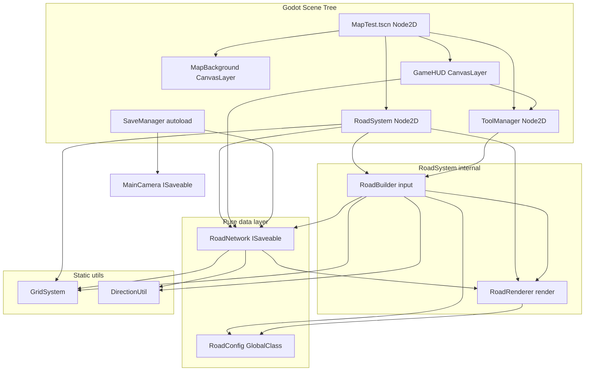
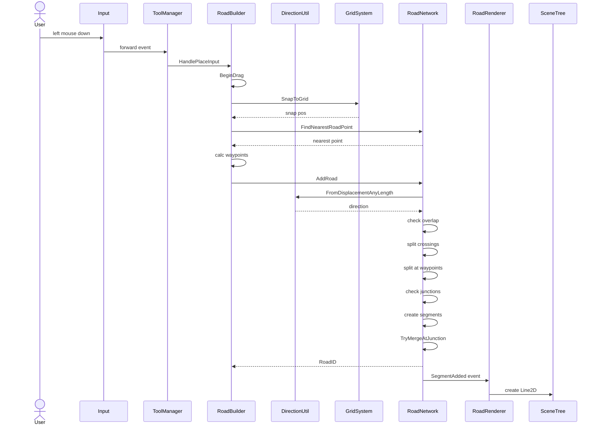
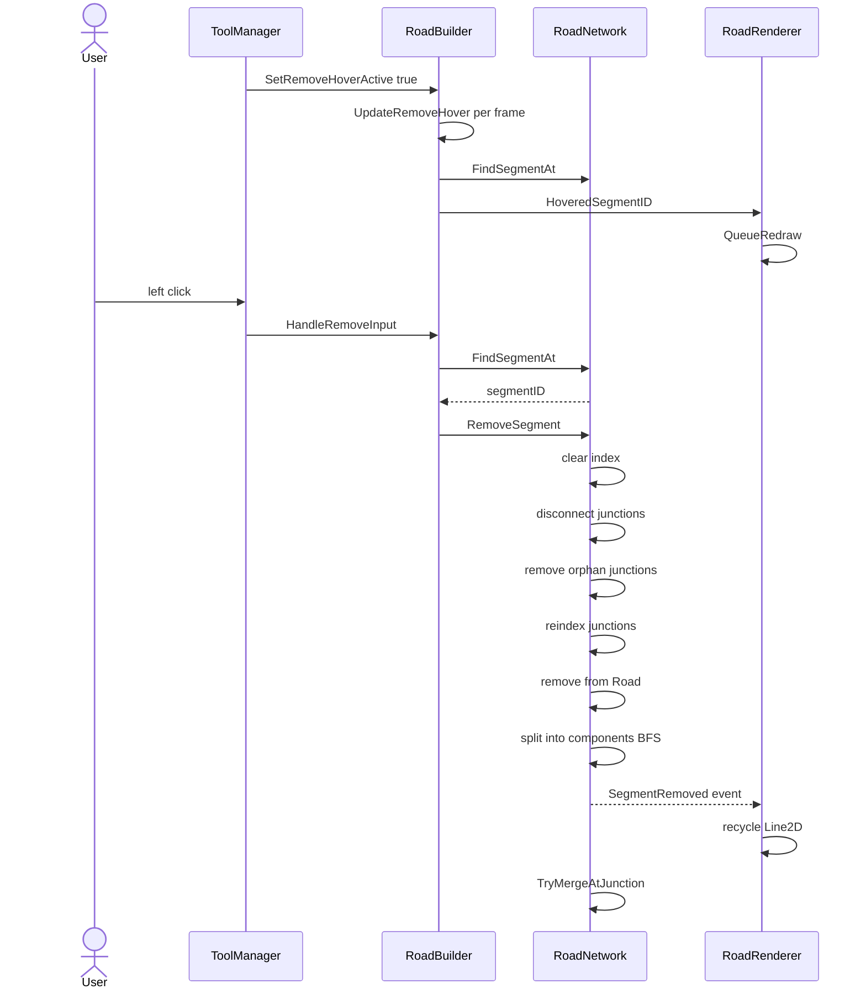
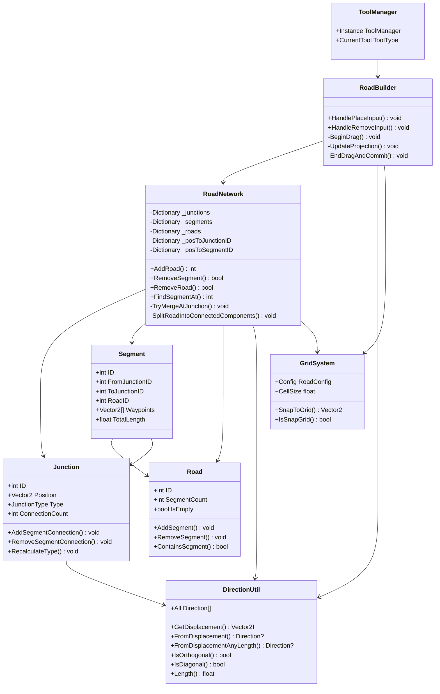
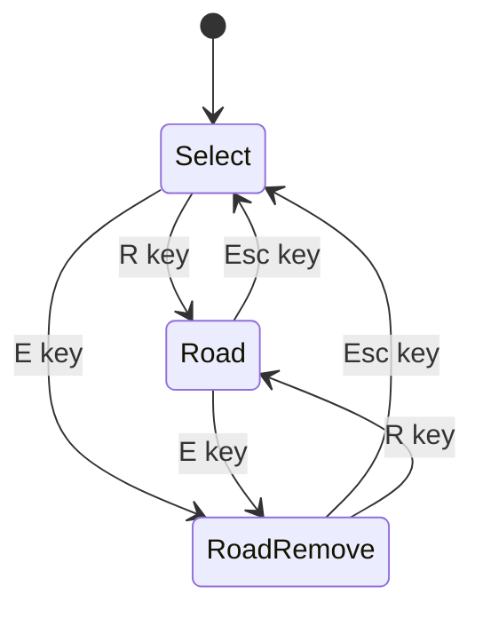
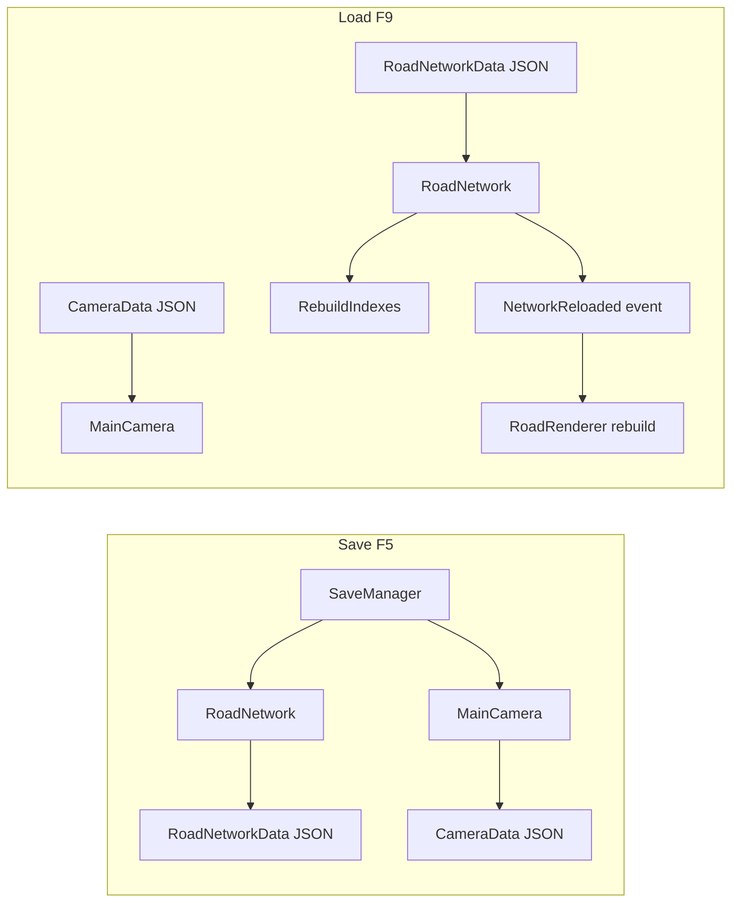
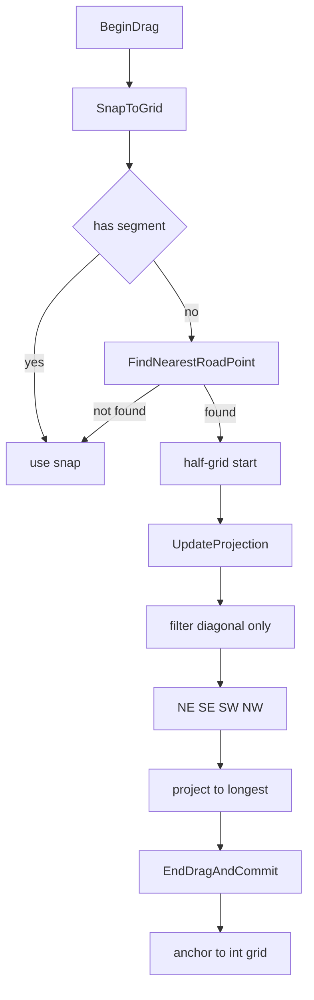
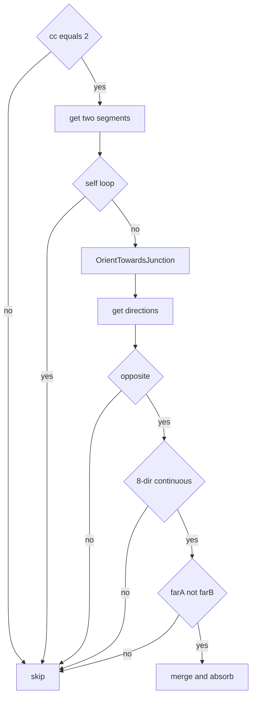
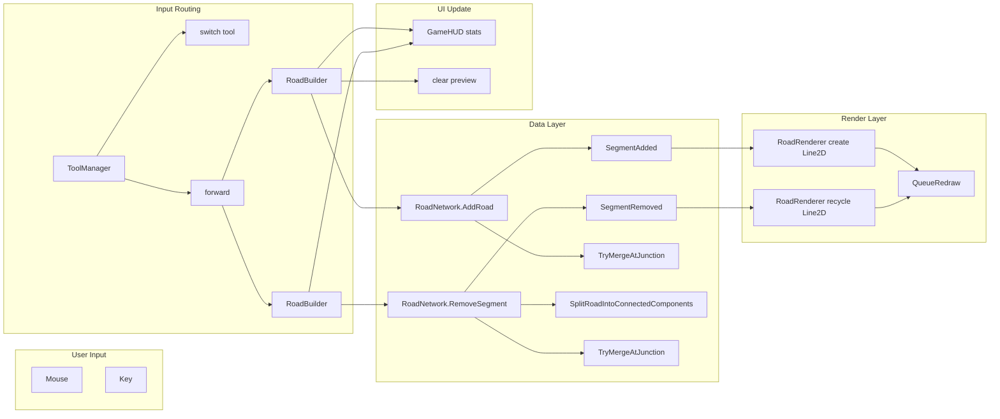

# 游戏总体逻辑

> 最后更新：2026-06-01

---

## 1. 系统架构总览

---

## 2. 道路铺设流程

---

## 3. 道路拆除流程

---

## 4. 路网数据模型

---

## 5. 工具状态机

**Select 状态**
- 默认状态，无操作

**Road 状态**
- onEnter: 无
- onTick: BeginDrag -> UpdateProjection
- onExit: CancelPlaceDrag

**RoadRemove 状态**
- onEnter: SetRemoveHoverActive true
- onTick: UpdateRemoveHover
- onExit: SetRemoveHoverActive false

---

## 6. 存档与读档

---

## 7. 关键决策流程

### 7.1 半格点拖拽方向限制

### 7.2 对向合并降级 TryMergeAtJunction

---

## 8. 事件流

