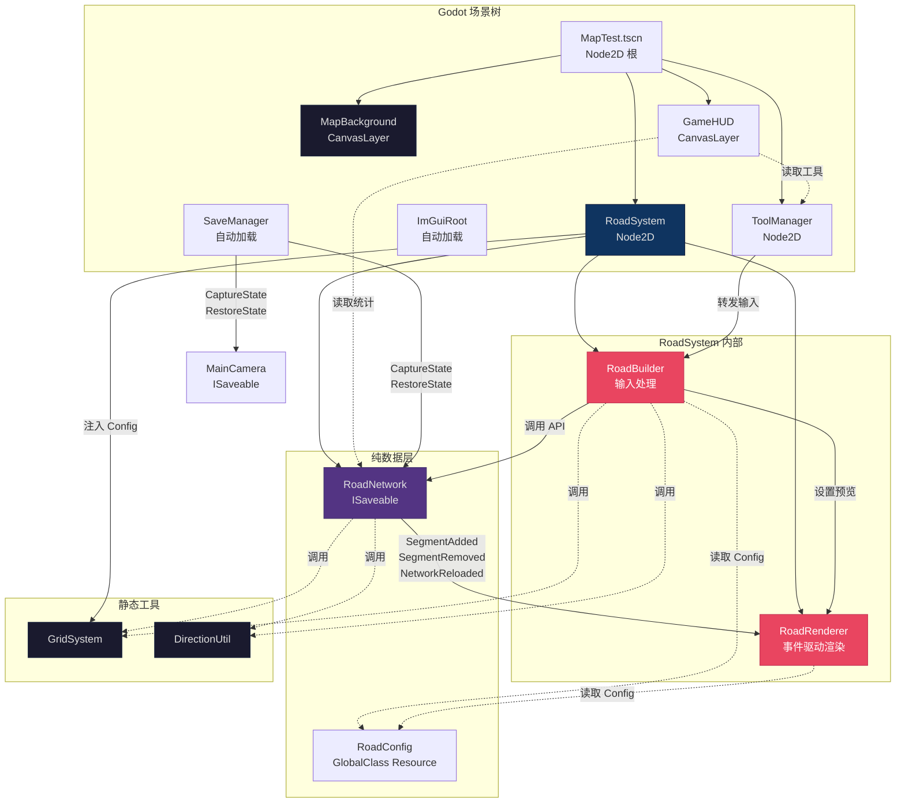
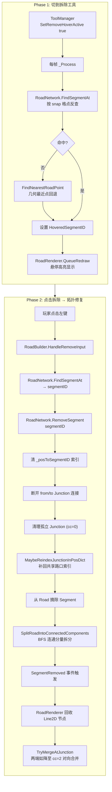
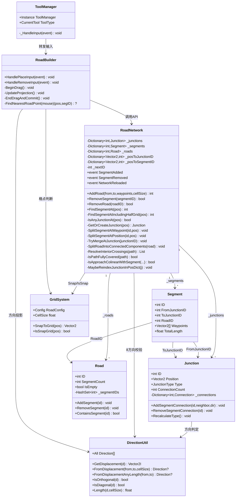
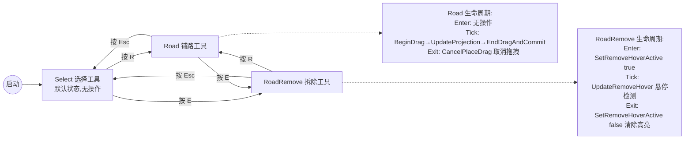
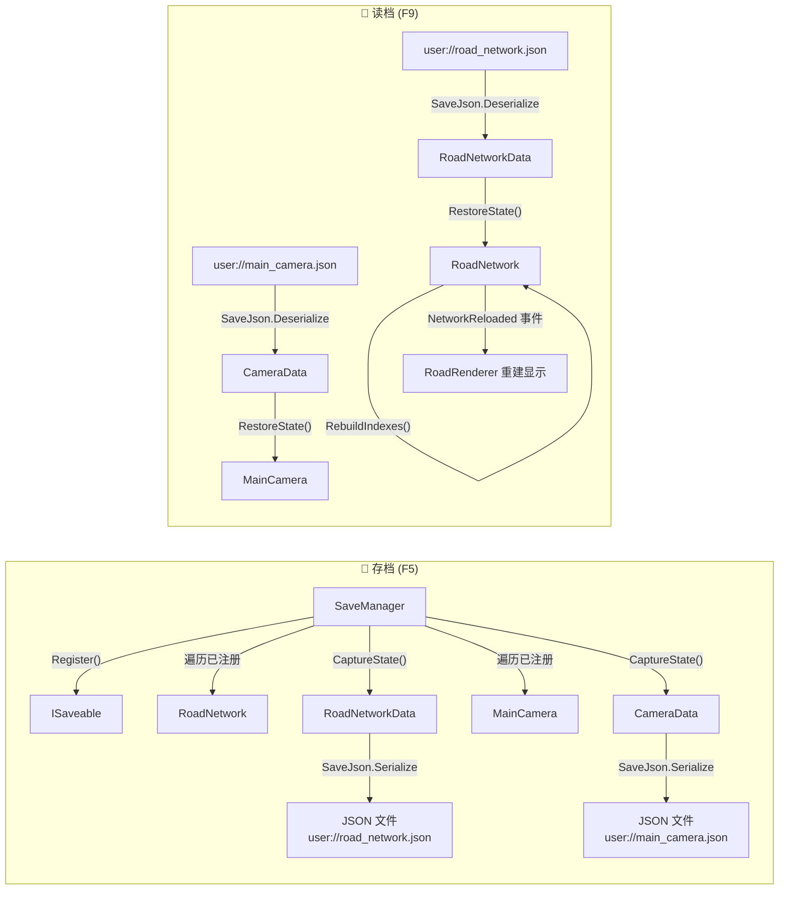
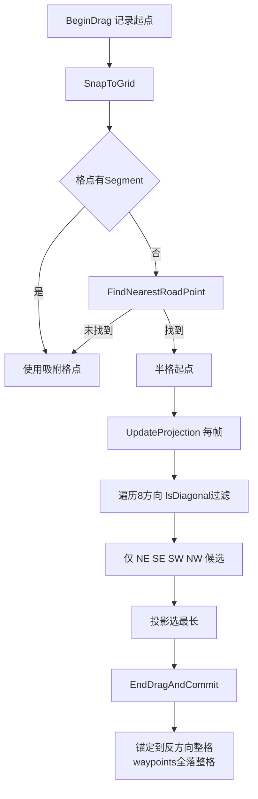
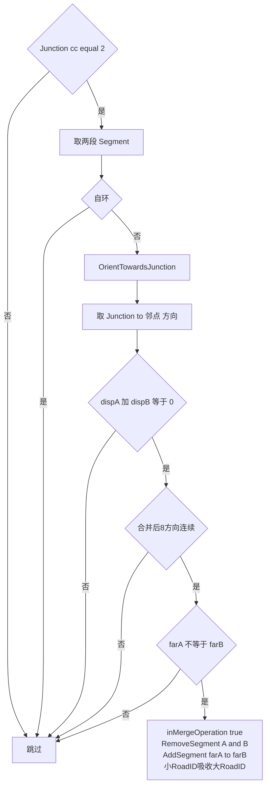
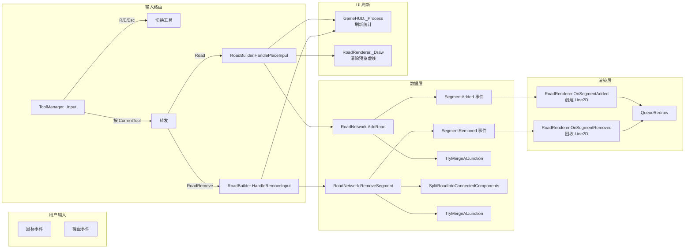

# 游戏总体逻辑

> 最后更新：2026-06-01

---

## 1. 系统架构总览

---

## 2. 道路铺设完整流程

```mermaid
flowchart TD
    subgraph Phase1["Phase 1: 拖拽开始"]
        direction TB
        S1["玩家按下左键"] --> S2["ToolManager 转发至 RoadBuilder"]
        S2 --> S3["RoadBuilder.BeginDrag"]
        S3 --> S4["GridSystem.SnapToGrid 吸附"]
        S4 --> S5{"格点上有 Segment?"}
        S5 -->|否| S6["FindNearestRoadPoint<br>半格点回退"]
        S5 -->|是| S7["记录起点<br>PreviewFrom = start"]
        S6 --> S7
        S7 --> S8["RoadRenderer.QueueRedraw"]
    end

    subgraph Phase2["Phase 2: 拖拽中 (每帧)"]
        direction TB
        D1["鼠标移动"] --> D2["RoadBuilder.UpdateProjection"]
        D2 --> D3["GridSystem.IsSnapGrid 检测"]
        D3 --> D4{"半格起点?"}
        D4 -->|是| D5["过滤: 仅 NE/SE/SW/NW<br>对角方向候选"]
        D5 --> D6["DirectionUtil.GetDisplacement<br>计算步长"]
        D4 -->|否| D6
        D6 --> D7["投影选最长方向 → 格数"]
        D7 --> D8["更新 PreviewTo<br>RoadRenderer.QueueRedraw"]
    end

    subgraph Phase3["Phase 3: 释放提交"]
        direction TB
        C1["玩家释放左键"] --> C2["RoadBuilder.EndDragAndCommit"]
        C2 --> C3["最终方向/格数确认"]
        C3 --> C4{"半格起点?"}
        C4 -->|是| C5["锚定到反方向整格<br>waypoints 全部落整格"]
        C5 --> C6["构建 waypoints 数组"]
        C4 -->|否| C6
        C6 --> C7["RoadNetwork.AddRoad"]
        C7 --> C8["DirectionUtil.FromDisplacementAnyLength<br>8方向合法性校验"]
        C8 --> C9["IsPathFullyCovered<br>完全重叠预检"]
        C9 --> C10["ResolveInteriorCrossings<br>X形几何交叉劈分"]
        C10 --> C11["SplitSegmentAtWaypoint<br>中段穿过劈开旧Segment"]
        C11 --> C12["IsAnyJunctionAt<br>半格路口检测"]
        C12 --> C13["按路口切段生成 Segments"]
        C13 --> C14["TryMergeAtJunction<br>接入前cc=1→合并降级"]
        C14 --> C15["SegmentAdded 事件触发"]
        C15 --> C16["RoadRenderer 创建 Line2D 节点"]
        C16 --> C17["ClearPreview + QueueRedraw"]
    end

    Phase1 --> Phase2
    Phase2 --> Phase3
```

---

## 3. 道路拆除 + 拓扑修复

---

## 4. 路网数据模型

---

## 5. 工具状态机

---

## 6. 存档 / 读档流程

---

## 7. 关键决策流程

### 7.1 半格点拖拽方向限制

### 7.2 对向合并降级(TryMergeAtJunction)

---

## 8. 事件流

