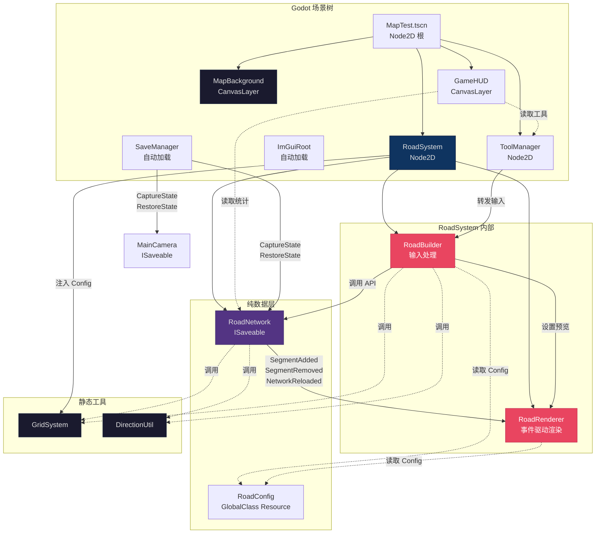
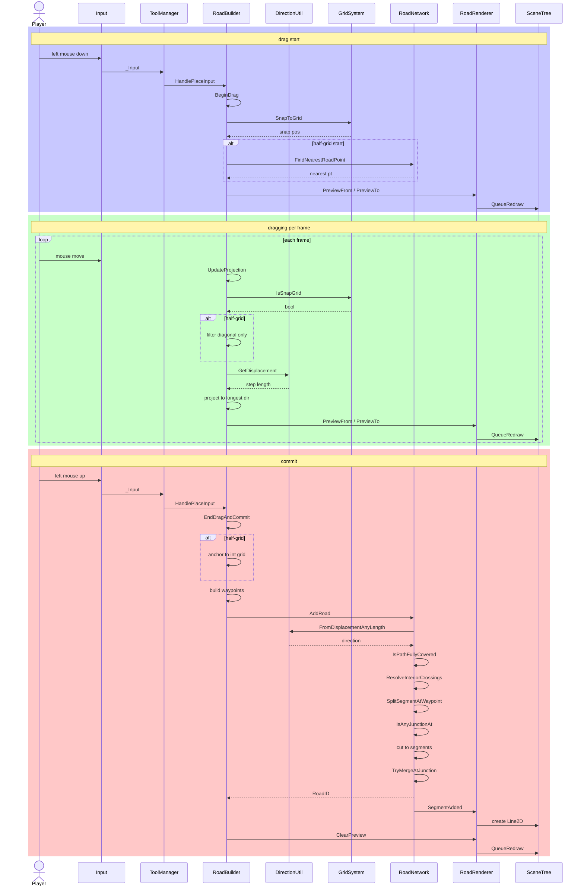
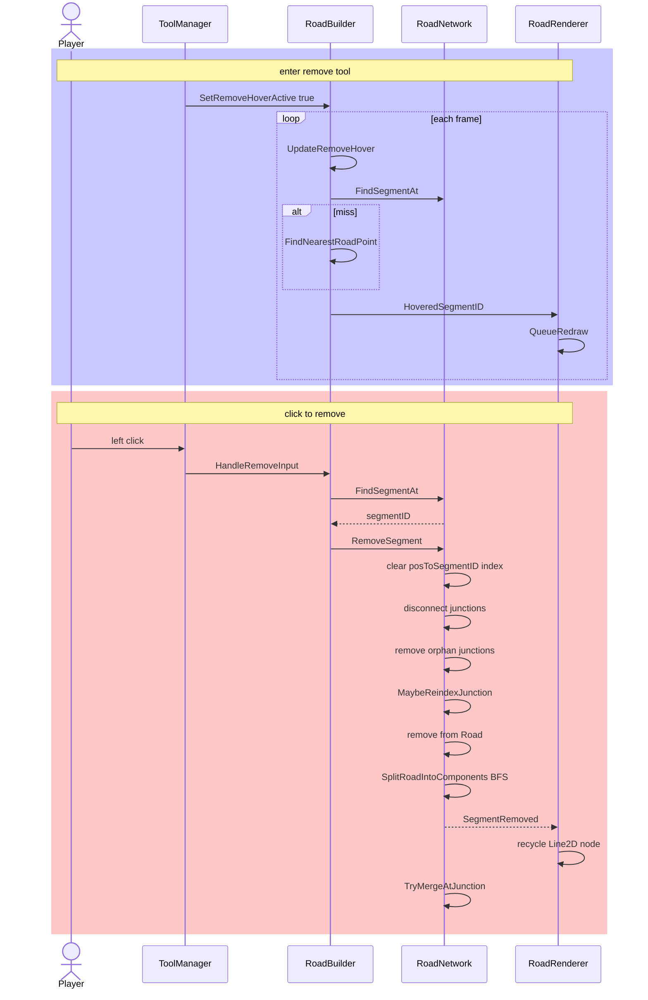
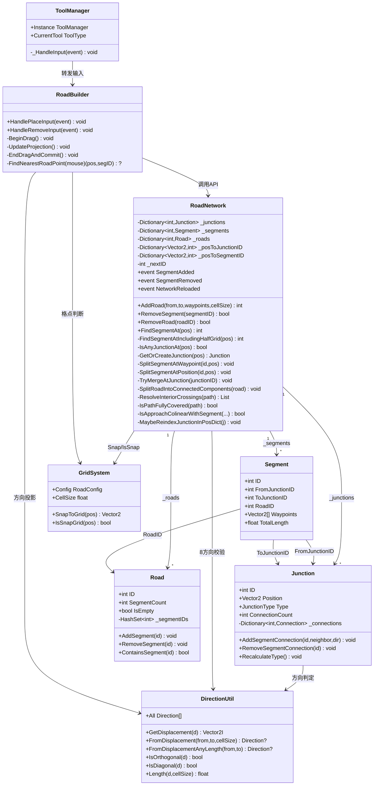
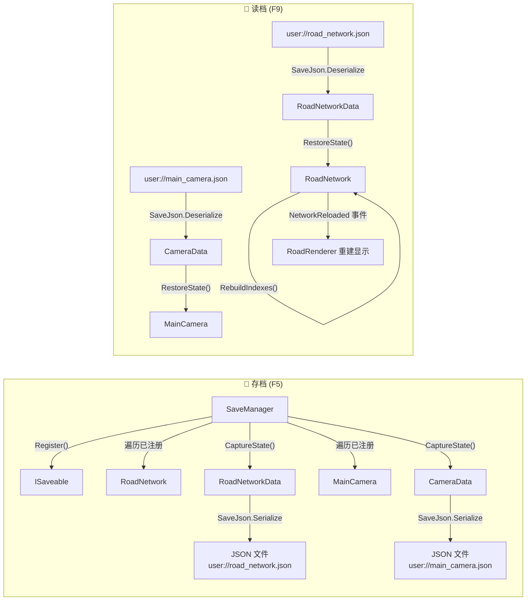
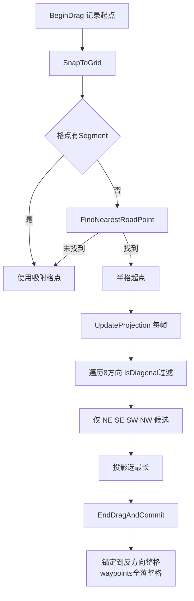
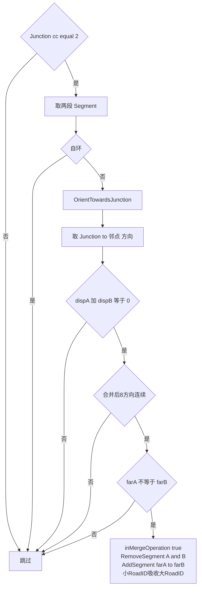
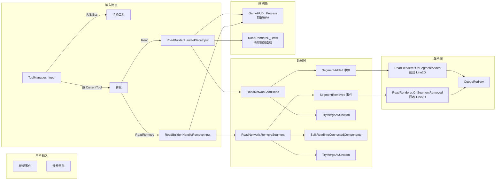

# 游戏总体逻辑

> 最后更新：2026-06-01

---

## 1. 系统架构总览



---

## 2. 道路铺设完整流程



---

## 3. 道路拆除 + 拓扑修复



---

## 4. 路网数据模型



---

## 5. 工具状态机

```mermaid
stateDiagram-v2
    [*] --> Select: startup

    Select --> Road: R key
    Select --> RoadRemove: E key

    Road --> Select: Esc key
    Road --> RoadRemove: E key
    note right of Road: onEnter: nop | onTick: BeginDrag to UpdateProjection | onExit: CancelPlaceDrag

    RoadRemove --> Select: Esc key
    RoadRemove --> Road: R key
    note right of RoadRemove: onEnter: SetRemoveHoverActive true | onTick: UpdateRemoveHover | onExit: SetRemoveHoverActive false
```

---

## 6. 存档 / 读档流程



---

## 7. 关键决策流程

### 7.1 半格点拖拽方向限制



### 7.2 对向合并降级(TryMergeAtJunction)



---

## 8. 事件流


