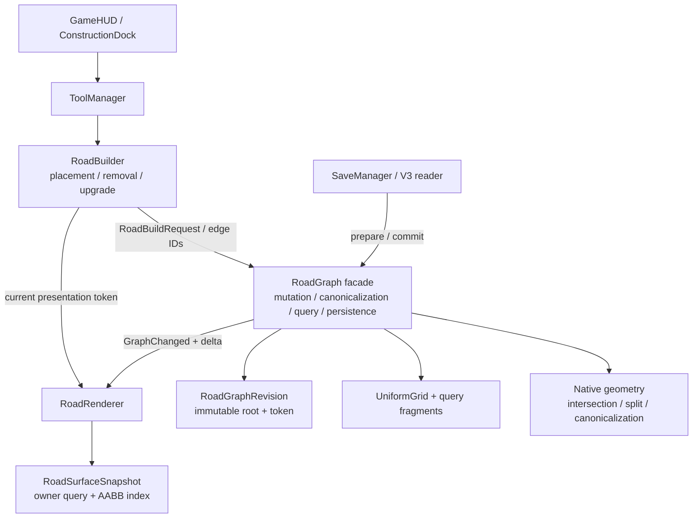
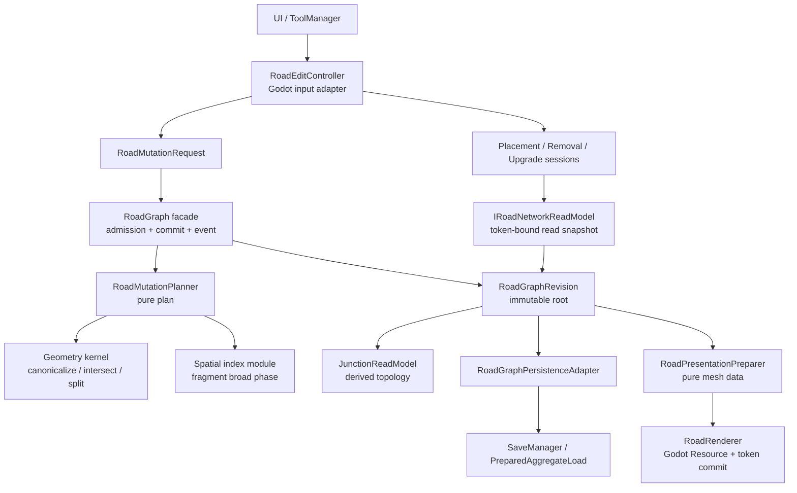

# 第3.5代道路系统指南

> 文档状态：设计与底层评估基线，2026-09-08。
>
> 本文根据当前工作树的 `Scripts/Road/` 实现编写。它描述 V3 收口后的下一步底层路线，不表示 3.5 代代码已经实现，也不改写 V3 的历史验收结论。当前工作区中 `docs/design/` 下与本文无关的未跟踪文件不属于本指南。

## 1. 结论

当前道路系统已经具备继续演进的工程基础。V3 解决了最危险的结构问题：道路不再由点击次数或网格单元决定，`GraphEdge` 能保存两个结构端点之间的连续原生几何链，`GraphNode` 用带端点角色的 incidence 表达邻接；变更通过不可变 revision、可逆 delta 和 state token 发布；renderer 以准备、资源预检和提交的顺序接管表现；V3 存档则对规范图执行有界解析和原子加载。

因此，第3.5代不应再重写道路图，也不应先引入分块 mesh、交通模拟或大量道路类型数值。最有价值的工作顺序是：

1. 把当前实现中的真实接口、失败语义和性能口径固化成一组小而稳定的读取与事务契约。
2. 将路口和转向关系提升为可消费的派生拓扑，使未来寻路、建筑接入和交通系统不必直接钻进 `RoadGraph` 的内部结构。
3. 将 `RoadType` 的显示身份与道路运行语义分开；只有在第一项实际玩法需要时，才把速度、容量、费用等字段纳入持久化领域模型。
4. 以测量结果决定 renderer 的局部更新或分块化，而不是因为 Edge 数变大就提前增加一套缓存和失效协议。

3.5 的目标是让道路系统从“可靠的几何编辑器”成长为“可靠的道路领域底座”。它不需要制造第二套生产 runtime，也不需要保留 V2 兼容路径。

## 2. 当前底层结构

当前道路模块在 `Scripts/Road/` 下共有 16,136 行 C#。其中 `RoadGraph*.cs` 共 15 个文件、约 5,103 行；`RoadRenderer.cs` 与 `RoadRenderer.LoadCommit.cs` 约 2,002 行；`RoadSurfaceSnapshot.cs` 约 1,124 行。partial 文件改善了文件定位，却没有改变 `RoadGraph` 仍是一个大型内部实现这一事实。

### 2.1 数据层

`GraphNode` 保存稳定 ID、位置和排序后的 `EdgeIncidence`。incidence 同时记录 `EdgeID`、`EdgeEndpoint.A/B` 和邻接节点 ID，因此自环的两个端接角色不会被压成一个普通邻居。`Degree` 是 incidence 数，`IncidentEdgeCount` 另行计算去重后的 Edge 数，这个区分对自环和路口判断是必要的。见 [`GraphNode.cs`](../../Scripts/Road/GraphNode.cs) 和 [`GraphEdge.cs`](../../Scripts/Road/GraphEdge.cs)。

`GraphEdge` 保存 ID、两个 canonical 端点、一个 `RoadType` 和有序的 `RoadGeometrySegment` 链。构造时会规范化几何、按端点 ID 决定方向、为自环选择稳定 seam，并拒绝不连续链。它已经是适合存档、渲染和后续语义扩展的规范存储单位。

`RoadGraphRevision` 将 Node、Edge、引用表、空间索引快照和资源计数放在同一个不可变 root 中。`CaptureRevision()` 是 O(1) root 捕获，`GraphStateToken` 区分 lineage、domain revision 和 change sequence。普通 mutation、undo/redo 和 full reset 都经过统一提交路径，外部 observer 只能收到一次 `GraphChanged`。这些能力是 3.5 应保留的核心资产，见 [`RoadGraphRevision.cs`](../../Scripts/Road/RoadGraphRevision.cs) 与 [`RoadGraph.Transactions.cs`](../../Scripts/Road/RoadGraph.Transactions.cs)。

### 2.2 几何与查询层

`UniformGrid` 只负责粗筛。长曲线会被 `RoadQueryFragmentFactory` 按 bounds 尺寸细分为查询 fragment，半径或矩形查询得到候选后，再由原生几何执行精确距离或相交判断。fragment 还保留源 geometry index 和参数范围，因此查询结果可以回到 `RoadLocation`，不会把显示采样点误当成领域几何。

提交路径的顺序是：输入校验、端点解析、已有道路与新路径的相交计划、重叠判断、交点聚类、容量 admission、拆分、添加和 canonical merge，最后一次性提交 root。删除和类型改造也会在提交后恢复最大连续 Edge。这个顺序已经形成足够深的外部模块：调用者只需要提交路径或 Edge ID，不能自行拼接节点和索引。

但几何相交的实现本质上是带空间和参数容差的自适应细分。当前通用曲线查询使用最大细分深度 24/48 和默认空间容差 `1e-3`，在叶节点用中点和 bounds 收敛，再做命中合并，见 [`RoadGeometryIntersectionQuery.cs`](../../Scripts/Road/Geometry/RoadGeometryIntersectionQuery.cs)。文档可以把它称作“容差控制的几何查询”，不应把它描述成任意曲线上的数学精确解。3.5 要先定义可接受误差、退化输入和 ambiguous intersection 的产品语义，再决定是否替换算法。

### 2.3 表现层

`RoadRenderer` 监听图变更，按 changed Edge 维护显示采样缓存；普通重建和 Load worker 共用 `RoadRendererLoadPreparer`，随后创建批量道路 mesh、节点 MultiMesh 和 `RoadSurfaceSnapshot`。`RoadSurfaceSnapshot` 以 `EdgeRibbon`、`TerminalCap`、`SemanticJoin` 和 `JunctionPatch` 作为 surface owner，并用自己的空间索引服务实际可见表面命中。

普通重建会把旧表现保留到新资源完成；失败时进入 stalled，provider 关闭，显式 retry 在相同 desired token 上恢复。Load 则先准备，再在主线程完成 Resource Preflight，最后由 aggregate commit 一次交换。这个表现层提交协议已经解决了“图已经换了但旧 overlay 还能提交”的主要问题。

当前实现仍有两个应被 3.5 明确记录的事实：

- 渲染 mesh 目前是全局批次，局部 mutation 虽只重采样 created/updated Edge，最终仍会构造新的完整批次和完整 surface snapshot。现有 10k 门禁和 100k 压力数据证明它可用，但不能据此推导任意规模都适合全局重建。
- renderer、surface 查询、输入选择和 GraphNode/GraphEdge 仍通过多个具体类型互相了解。token 保护了代际一致性，却没有把道路读取接口本身收窄为一个独立 seam。

## 3. 评价

| 维度 | 评价 | 依据与含义 |
| --- | --- | --- |
| 规范数据模型 | 强 | canonical Edge、incidence、自环、平行 Edge 和原生几何链已经统一；不应再添加 waypoint 或 Group 作为隐含拓扑。 |
| 事务正确性 | 强 | admission 先于修改，root swap 与 delta 一起提交，state token 拒绝旧操作，observer 异常不回滚已提交 root。 |
| 存档与恢复 | 强 | V3 reader 有容量和词法预算，Load 采用 prepared aggregate；3.5 只需为新增领域数据扩展 schema。 |
| 表现一致性 | 中上 | 普通重建和 Load 共用 preparer，surface hit 与可见 mesh 同源；全局批次和大型 renderer 仍是规模风险。 |
| 几何可靠性 | 中上 | 覆盖、拆分、曲线相交和重叠有明确拒绝路径；容差细分的误差合同、极端曲率和超长曲线仍需公开测量。 |
| 领域表达能力 | 偏弱 | `RoadType` 只有四个枚举值，样式有颜色和宽度；速度、容量、车道、费用、建筑接入和转向限制没有领域表示。 |
| 模块深度与局部性 | 中等 | 外部 `RoadGraph` 接口较深，但内部一个 facade 同时承担规划、容量、规范化、索引、诊断、持久化和通知；修改影响面仍大。 |
| 线程模型 | 清晰但有限 | 异步 Load 在后台准备，提交和 Godot Resource 操作回到主线程；`RoadGraph` 本身不是线程安全容器，不应把后台读写当成已支持能力。 |

总体评价是：V3 的“基础设施正确性”已经达到可以承载下一代功能的程度，V3 的“道路领域语义”还没有达到城市模拟底座的程度。下一步应增加可被多个系统复用的语义读取能力，而不是继续增加保存、token 和故障注入的内部组合。

## 4. 3.5 代设计原则

### 4.1 保留一个权威图和一个提交点

`RoadGraph` 继续是唯一写入入口。任何新功能都通过准备好的 mutation request 或已有的 `ChangeRoadType`/`RemoveEdges`/`SubmitPath` 进入统一 admission 与 commit。禁止让 renderer、交通、建筑或 UI 直接修改 `GraphNode`、`GraphEdge`、incidence 或空间索引。

### 4.2 新增读取 seam，不暴露实现细节

3.5 应增加一个面向消费者的只读道路查询接口，名称可以在实现时确定，例如 `IRoadNetworkQuery`。接口只表达调用者真正需要的操作：按 Edge 或位置读取规范信息、枚举端接、查询相邻 Edge、获取局部 `RoadLocation`、获取与 state token 绑定的只读 snapshot。它不返回可变 builder、UniformGrid bucket、Godot Resource 或 renderer mesh。

这里的 seam 要有足够深度：路口识别、端点方向、Edge 方向转换、self-loop 两个端接和 parallel Edge 的稳定排序都在实现内完成。若 renderer、输入和未来 traffic 各自重复这些判断，3.5 就没有解决底层问题。

### 4.3 区分稳定身份、领域语义和表现样式

`RoadType` 当前同时参与 merge key、存档和样式选择。3.5 可以保留它作为稳定道路分类，但不应继续向枚举本身塞入颜色、宽度、速度或费用。建议分成三层：

| 层 | 内容 | 持久化要求 |
| --- | --- | --- |
| Edge identity | Edge ID、NodeA/NodeB、geometry chain | V3 payload 的规范结构 |
| Road profile | 供玩法消费的稳定 profile ID 与领域属性 | 只有正式启用 profile 后才进入新 schema |
| Presentation style | 颜色、宽度、材质和 surface 参数 | 由配置快照解析，不写回图；若样式需要存档，应绑定版本化 style identity |

在没有消费方之前，不要为了“未来可能有交通”给每条 Edge 添加未使用的速度和容量字段。先把 profile seam、默认值、版本和无效配置行为写清楚，再由实际玩法决定字段。

### 4.4 把拒绝说清楚

当前代码对数值、几何、重叠、容量、重入和 token 失配都有拒绝结果，但部分结果仍需调用者结合枚举和诊断推断原因。3.5 的新接口应返回结构化拒绝信息，至少区分：

- 输入不合法：非有限坐标、断链、退化段、未知几何类型；
- 领域冲突：覆盖、属性不兼容、禁止转向或禁止接入；
- 资源限制：Node、Edge、geometry、fragment、candidate、witness 或历史预算；
- 代际失配：facade、revision、presentation 或 scene generation 已变化；
- 环境失败：Resource 创建、文件系统或外部 participant 失败。

错误信息应服务于 UI、日志和测试，不应要求 UI 解析异常字符串。

### 4.5 重构与解耦方案

3.5 采用“保留外部 facade、拆分内部实现、逐个迁移消费者”的重构方式。`RoadGraph` 继续是稳定 facade 和唯一提交点，现有 V3 调用者不需要同时面对新的多个写入对象。重构的判断标准是模块的深度和 locality：一个模块的接口应保持小而稳定，把规划、索引、资源管理和失败处理隐藏在实现中；调用者不应通过直接读取内部集合来完成自己的拓扑工作。

目标依赖关系如下：

#### 4.5.1 目标模块和职责

| 目标模块 | 负责内容 | 不负责内容 | 推荐 seam |
| --- | --- | --- | --- |
| `RoadGraph` facade | 当前 root、mutation admission、commit、`GraphChanged`、lineage/sequence | 具体曲线算法、surface triangle、UI 输入 | 现有 public graph facade，保持唯一写入点 |
| `RoadGraphRevision` | immutable Node/Edge、派生索引快照和资源计数 | 任何可变编辑、Godot Resource | 现有 revision root |
| `RoadMutationPlanner` | 校验请求、交点 witness、cluster、overlap、split/merge 计划和资源估算 | 修改工作状态、发布事件 | `RoadMutationRequest -> RoadMutationPlan` |
| `RoadGraphWorkingState` | 未发布 builder、ID 分配、索引增删、候选 plan 应用 | 对外读取、异步共享 | 只由 `RoadGraph` 在 commit 前持有 |
| geometry kernel | `RoadGeometrySegment`、canonicalizer、direction、intersection、subdivision | Node/Edge 业务规则、UI | 先使用现有 static module；有第二种算法时再引入 adapter seam |
| spatial index module | fragment 生成、UniformGrid 粗筛、coverage 校验 | 权威几何结论、道路业务语义 | `SpatialQueryCandidate` 内部读取接口 |
| `RoadGraphReadSnapshot` | Edge/Node view、incidence、端点切线、`RoadLocation`、局部查询 | mutation、索引 bucket、存档写入 | `IRoadNetworkReadModel` |
| `JunctionReadModel` | 由 read snapshot 派生路口端接和转向关系 | 持久化 Node、修改 GraphNode、交通状态 | `RoadGraphRevision -> JunctionSnapshot` |
| `RoadGraphPersistenceAdapter` | V3 payload 写入、读取和 prepared state 构造 | 图规划、UI、槽位发布 | `IStreamingSaveable`，由 `RoadGraph` 暂时转发 |
| `RoadPresentationPreparer` | display sampling、ribbon、cap、join、patch、surface index 的纯数据准备 | `ArrayMesh`、`MultiMesh`、场景树、输入 | 现有 `RoadRendererLoadPreparer` 的纯 CLR 部分 |
| `RoadRenderer` | Godot Resource 生命周期、presented token、deferred rebuild、提交和 warning | 道路拓扑决策、存档格式 | `IRoadSurfaceSelectionProvider` 与 `RoadRenderToken` |
| `RoadEditController` | 输入事件、会话生命周期、命令调用、预览 | 几何相交、图内部集合、业务写入细节 | `RoadBuilder` 继续作为外部 Godot adapter |
| `PreparedAggregateLoad` | 多 participant generation、统一引用交换、通知和 cleanup | 道路图规则和 renderer 几何 | 现有 Core commit-plan 接口 |

这里不建议为每个内部类都增加一个公共 interface。geometry kernel 目前只有一套生产实现，直接使用小型 static module 可以保持 locality；只有出现第二种有效算法、真实测试替身或平台实现时，才在对应 seam 放置 adapter。`IRoadNetworkReadModel` 和 `RoadMutationPlan` 则是现在就需要的 seam，因为它们分别服务多个消费者和统一事务规划。

#### 4.5.2 迁移规则

1. 先把当前行为写成 characterization test，再移动实现。测试应断言最终 Node/Edge、geometry、incidence、`GraphStateToken`、delta、事件次数和失败无副作用。
2. 每次只迁移一个职责。移动代码后，旧 facade 只做委托；不得在新旧模块各保留一套相似算法。
3. 新模块先接收不可变输入并返回结果，再考虑注入可变工作状态。规划模块不得持有 `RoadGraph` facade，也不得读取未发布 builder。
4. 所有成功写入仍从 `RoadGraph` 经过一次 admission、一次 root commit 和一次 `GraphChanged`。重构期间不增加第二个 graph event、第二个 writer 或第二个 history 入口。
5. 消费者先迁移到 `IRoadNetworkReadModel`，再收紧 `GraphNode`、`GraphEdge`、`GetAllNodes()` 和 `GetAllEdges()` 的可见范围。测试可以通过 `RoadGraphRevision` 或 read snapshot 获取全量数据，不把生产全量枚举保留为长期公共入口。
6. `RoadRenderToken` 只表示表现代际，不替代 graph state token；`JunctionReadModel` 也必须携带来源 graph token。任何异步结果都要在接收处做 generation 校验。
7. `RoadGraphPersistenceAdapter` 不产生第二种存档格式。迁移期间只能有一个 V3 writer 和一个 V3 reader，旧 `RoadGraph` 接口若保留，只能是同一实现的短期内部转发。

#### 4.5.3 具体执行批次

| 批次 | 改动 | 通过条件 |
| --- | --- | --- |
| R0 | 先处理审计发现的交点聚类排序、单 geometry 自交语义、Load commit 契约、性能计数和非有限 bucket 参数；补回归测试并校准文档 | 现有 959/959 仍通过；新增问题各有明确“修复”或“保留并拒绝”的结果 |
| R1 | 建立 `RoadGraphReadSnapshot` 和 `IRoadNetworkReadModel`；先让 DebugPanel、RoadBuilder 读取 seam | renderer、输入和诊断都不再为路口逻辑直接访问 graph 内部；旧 token 行为不变 |
| R2 | 从 `RoadGraph.PathSubmission` 抽出 `RoadMutationPlanner`，先只迁移 native path 计划；`RoadGraph` 保留 commit 和工作状态 | 直线、六类原生 geometry、覆盖、重叠、自交、split、merge、ID 和 delta 结果逐值一致 |
| R3 | 抽出 `RoadGraphWorkingState` 和 spatial index module；将资源计数与索引维护集中到工作状态 | planner 不修改状态；失败恢复不再依赖复制后再恢复整组 builder；局部 query 指标不退化 |
| R4 | 抽出 `JunctionReadModel`，由 revision 派生端接、切线和转向关系；先接一个实际只读消费者 | self-loop A/B、parallel Edge、T/X、两路口环和类型边界均能稳定读取 |
| R5 | 把 `RoadGraph.Persistence*.cs` 改为 persistence adapter；保留 `RoadGraph` 对 SaveManager 的稳定装配入口 | V3 payload 字节、schema 拒绝、Load lineage、aggregate plan 顺序和失败状态不变 |
| R6 | 把 `RoadRendererLoadPreparer` 的纯数据部分下沉为 `RoadPresentationPreparer`；RoadRenderer 只保留 Godot 生命周期和 token commit | 普通 rebuild 与 Load 生成相同 surface owner、`RoadLocation` 和 mesh 数据；资源转交前后的 cleanup 不变 |
| R7 | 将 RoadBuilder 的输入协调和命令调用下沉为 `RoadEditController`；Placement/Removal/Upgrade session 保持独立 | UI 只传递命令和状态；取消、旧 token、Load、undo/redo 和预览行为逐项一致 |
| R8 | 删除没有生产调用者的旧折线辅助链、过渡转发和过宽可见性；同步 class reference 和本指南 | 单一生产路径、单一事件、单一 writer；全套静态、CLR、Godot runtime 和性能门通过 |

R0 是重构前置批次。当前审计已经确认 `RoadIntersectionClusterer` 的扫描顺序和单段曲线自交存在行为缺口；在这两项没有确定结果前，把规划代码移动到新类只会改变缺陷位置。R3 也不应把“复制整组 mutable builder 再恢复”包装成并发安全；它解决的是职责局部性，线程安全仍保持未支持。

#### 4.5.4 Load commit 的特殊处理

当前 `PreparedAggregateLoad` 的关键保证是：generation 复核通过后，所有 participant 的 `CommitReferences()` 依次交换引用，随后才发布通知和执行 cleanup。由于接口名称为 `INonThrowingLoadCommitPlan`，3.5 应把“不抛异常、不 yield、只交换已准备引用”提升为可执行的代码契约：

- `CommitReferences()` 只能进行字段引用替换、状态标记和已验证的 token 更新；不得分配 Godot Resource、访问文件系统、调用用户回调或执行可失败的几何运算；
- 需要可能失败的工作必须在 Preflight 完成，并由 plan 的构造校验承担；
- 用测试 plan 注入 commit 中途异常，确认生产 plan 不会走到该状态；如果将来出现必须抛异常的 participant，则需要增加 rollback-capable plan 协议，不能继续使用当前“全有或全无”措辞；
- `CompleteCommit()` 和通知失败只能形成 warning，不得把已经完成的 reference swap 降级为失败。

这样可以保留当前 aggregate 的深接口，同时把其最关键的隐含前提变成可审计的接口事实。

#### 4.5.5 重构停止条件

出现以下情况时暂停重构并回到上一个批次：

- 新模块需要调用 `RoadGraph` 的私有状态或复制 `_nodes`、`_edges`、bucket 页面；
- 同一个几何判断在 planner、renderer 或 input 中出现第二份实现；
- 新 read model 只能返回 `GraphNode`、`GraphEdge` 或 renderer 内部类型，无法隐藏实现；
- 迁移后事件数量、delta changed set、ID watermark、history 或任何 token 发生无解释变化；
- 失败路径只能依赖异常文本分类，或 commit 之后还需要补救关键引用；
- 为了通过性能门而关闭 invariant、跳过 candidate 计数或把后台 worker 时间归入另一个阶段。

## 5. 分阶段路线

执行顺序采用 4.5 的 R0～R8 批次；本节的阶段是面向产品和验收的汇总，R 批次是面向源码迁移的工作切片。两者都遵守“先测试和 seam，再委托迁移，最后删除旧路径”的顺序。

### 阶段 0：重新建立当前基线

目标是把 V3 收口后的事实压缩成可长期复跑的基线，不修改生产代码。

交付内容：

1. 固定 canonical graph fixture：直路、连续共线链、混合曲线链、自环、两路口环、八字形、平行 Edge、T/X/锐角路口、删除支路后的重归一化。
2. 固定 geometry-dense 与 junction-dense 两套数据，并记录 Node、canonical Edge、geometry segment、query fragment、bucket entry、surface primitive、mesh vertex 和一次提交的分段时间。
3. 为曲线相交记录空间误差、参数误差、最大细分深度、ambiguous 拒绝和 candidate/witness 上限命中情况。
4. 以 `GraphStateToken` 为索引记录 mutation、undo/redo、Load、style refresh 和 presentation retry 的状态转换。

完成条件：所有指标都来自当前代码入口；历史 V3 文档中的旧测试数字只作历史证据，不与新基线拼接。

### 阶段 1：建立只读道路查询模块

这是 3.5 的首要实现阶段。先实现一个 CLR 可测试的只读模块，再让 renderer、输入和 DebugPanel 逐步消费它。

建议能力：

- `GetEdge(edgeID)` 返回只读规范 Edge view；
- `GetNode(nodeID)` 返回只读 Node view；
- `EnumerateIncidences(nodeID)` 保留 A/B 端接角色；
- `GetEndpointLocation(edgeID, endpoint)` 返回 canonical `RoadLocation` 与出射方向；
- `FindClosestEdge`、`FindEdgesNear`、`FindEdgesIntersecting` 统一返回带 token 的结果；
- `EnumerateConnectedEdges(nodeID)` 对 self-loop 和 parallel Edge 使用稳定顺序；
- `CaptureSnapshot()` 返回与 revision token 绑定的只读读取根。

实现约束：

1. 查询模块只能读取 `RoadGraphRevision`，不能读取工作中的 mutable builder。
2. 查询结果必须携带捕获时的 token；消费者在确认操作时仍要做 current 校验。
3. 不把 `UniformGrid` 或 surface index 的内部类型提升为公共领域接口。
4. 不为了抽象而复制整张图；同一 revision 的 snapshot 应复用 immutable root。

验收重点是“同一份只读事实被多个消费者使用”，不是新增一层只转发 `RoadGraph.GetNode()` 的薄适配器。若接口只是把现有 public 方法逐个改名，应停止并重新收窄 seam。

### 阶段 2：派生路口与转向拓扑

在阶段 1 的 snapshot 上增加 `JunctionReadModel` 或等价的内部派生模块。它不是新的持久化 Node，也不取代 GraphNode；它把几何端接转换成后续系统可用的拓扑事实。

第一版只需要：

- 路口 ID 与所属 GraphNode ID 的映射；
- 每个端接的 Edge、A/B、切线方向、道路类型或 profile；
- 两个端接之间的转向角、方向分类和稳定排序；
- self-loop 的 A→B、B→A 以及同一 Edge 的回转语义；
- parallel Edge 的独立身份；
- 不允许的退化转向和缺失端接的诊断。

第一版不要直接做车辆流量、拥堵或 A*。这些数据应消费这个只读路口模型，而不应反过来把交通状态塞回 GraphNode incidence。

验收场景至少包括：

| 场景 | 必须证明 |
| --- | --- |
| 普通 T/X 路口 | 每个端接方向唯一，转向排序稳定 |
| 自环 | A/B 不合并，回转关系不丢失 |
| 平行 Edge | 以 Edge ID 区分，不因相同端点合并 |
| mixed RoadType | 语义边界可读，类型改变后派生结果同步更新 |
| 删除支路 | 删除后的新 canonical Edge 生成新快照，旧快照仍可读但不可提交 |
| Load 与 undo/redo | lineage 或 sequence 变化能使旧路口读取结果失效 |

### 阶段 3：道路 profile 与接入规则

只有阶段 2 已经有实际消费方时才进入本阶段。推荐先做静态、可解释的属性，不直接做动态交通模拟。

建议最小范围：

1. profile catalog 具有稳定 ID、版本和严格校验。
2. Edge 只保存 profile identity；样式通过 profile 或配置快照解析，避免把 Resource 放入后台准备对象。
3. 建造和 RoadUpgrade 返回 profile 变化摘要，并保持一次 graph event、一次 delta 和一次 presentation token 取代。
4. 建筑接入先作为独立查询和拒绝规则，不把建筑引用写进道路几何 Edge。
5. 存档升级采用新的明确 schema/version；旧 V3 payload 直接按已有规则拒绝或由一次性离线迁移工具处理，不能在普通 Load 中猜测字段。

速度、车道、容量、维护费等字段要逐项绑定到实际玩法和测试。没有查询、UI 或模拟消费的字段不应进入正式 payload。

### 阶段 4：表现层规模化决策

阶段 0 的测量若显示 global batch rebuild 已成为主要成本，再评估局部 mesh 或 chunk。决策顺序如下：

1. 先确认成本来自 snapshot prepare、surface triangulation、Resource 创建、主线程提交还是 GPU 绘制。
2. 若瓶颈是 prepare，先让 `RoadRendererLoadPreparer` 共享更细的 immutable geometry/display cache。
3. 若瓶颈是主线程 Resource 创建，限制每帧提交预算，并保留同一 desired/presented token 协议。
4. 若瓶颈是空间范围，才引入按世界区域管理的 presentation chunk。
5. chunk 只有在每个 chunk 拥有明确 generation、资源 ownership、失败释放和 query token 后才能进入生产。

禁止用“Edge 数很多”作为分块理由。3.5 的局部更新必须同时证明：远端道路不会被重建、命中查询不会跨代、删除和 Load 不会遗留旧 chunk、失败仍保留上一代完整表现。

## 6. 不变式与性能门

3.5 每个阶段都要继续检查以下不变式：

- Edge 的 geometry chain 与 NodeA/NodeB 位级连续；
- Node incidence 与 Edge 两端完全互相对应；self-loop 有两个端接角色；
- 同一 Edge 不因 query fragment 变成多个领域 Edge；
- 相同 RoadType 或 profile 的 degree-2 节点只在规范规则允许时合并；
- spatial index 是可重建的派生结构，coverage 与实际引用一致；
- 失败提交不改变 root、ID watermark、lineage、sequence、history 或事件；
- 旧 token、旧 surface 和旧异步 continuation 不能写入新代状态；
- renderer 资源在转交前失败会释放，转交后失败只产生结构化 warning；
- 存档读取不静默补字段、改几何、猜类型或导入 V2 数据。

性能口径必须保持分离：

| 口径 | 用途 |
| --- | --- |
| `RoadGraph` mutation / query | 评价领域提交和局部查询，不包含 Godot Resource 或 GPU |
| renderer prepare / preflight / presentation commit | 定位表现层阶段成本 |
| `Step` 到 frame post draw 或等价端到端 | 评价玩家看到的完整交互延迟 |
| 100k 压力结果 | 识别拐点和风险，不自动成为硬门 |

建议硬门继续使用 10k junction-dense 的交互 P95 低于 16.67 ms，并要求固定局部查询窗口中远端 geometry 增长不增加 exact test 数。对 100k 只报告分段结果和是否出现 AppHang；除非产品目标改变，不把它和 10k 玩家交互门混成一个数字。

## 7. 明确暂缓事项

以下内容可以在 3.5 的设计中留下 seam，但不应作为 3.5 底层收口条件：

- TrafficGraph、A*、动态拥堵和车辆行为；
- 多车道、单向道路和信号灯；
- 桥、隧道、立交和真正的高程层；
- 自由曲线控制点编辑器；
- 未经测量的 global-to-chunk renderer 重写；
- V2 存档迁移、双 writer、双事件或兼容 facade；
- 为未来可能使用而提前持久化大量未消费的道路数值。

这些事项重新开启时，必须先引用阶段 1 的只读查询 seam，并说明其对 canonical Edge、self-loop、parallel Edge、profile、token 和 Load aggregate 的影响。

## 8. 推荐执行顺序与停止条件

推荐顺序是“阶段 0 基线 → 阶段 1 只读查询 → 阶段 2 路口转向模型 → 按实际需求选择阶段 3 或阶段 4”。每个阶段完成后都要回写本指南的当前事实和证据链接，再决定是否进入下一阶段。

在以下任一条件满足时应停止扩展并修复当前阶段：

1. 新消费者需要直接读取 `RoadGraph` mutable builder、`UniformGrid` bucket 或 renderer 内部 cache；
2. 为支持新功能而出现第二个 graph event、第二套提交点或第二种 token；
3. 一个失败路径能改变部分 Node/Edge、history、surface 或 slot 状态；
4. 路口结果无法区分 self-loop 端接或 parallel Edge；
5. profile/style 配置无版本、无严格校验或需要静默 fallback；
6. 性能优化没有显示 prepare、preflight、commit、draw 和端到端各自的测量边界；
7. 新功能只能通过扫描全图或复制整张 immutable root 才能工作。

3.5 的完成定义不是“道路功能更多”，而是至少有一个真实消费者通过稳定只读 seam 使用路口/道路语义，仍由唯一 `RoadGraph` 提交 root，保留 V3 的失败原子性和 token 代际保护，并用代表性 runtime 与性能证据证明新增语义没有破坏现有编辑、Load、undo/redo、命中和表现一致性。

## 9. 依据文件

- [`Scripts/Road/RoadGraph.cs`](../../Scripts/Road/RoadGraph.cs)：公共提交、删除和空间查询入口。
- [`Scripts/Road/RoadGraph.PathSubmission.cs`](../../Scripts/Road/RoadGraph.PathSubmission.cs)：原生路径校验、交点计划和一次提交。
- [`Scripts/Road/RoadGraph.Admission.cs`](../../Scripts/Road/RoadGraph.Admission.cs)：资源与 mutation work admission。
- [`Scripts/Road/RoadGraph.Canonicalization.cs`](../../Scripts/Road/RoadGraph.Canonicalization.cs)：删除后的最大连续 Edge 与 loop seam 保护。
- [`Scripts/Road/RoadGraph.Transactions.cs`](../../Scripts/Road/RoadGraph.Transactions.cs)：revision、delta、token 和事件提交。
- [`Scripts/Road/Geometry/RoadGeometryIntersectionQuery.cs`](../../Scripts/Road/Geometry/RoadGeometryIntersectionQuery.cs)：曲线相交的容差细分实现。
- [`Scripts/Road/SpatialIndex.cs`](../../Scripts/Road/SpatialIndex.cs)：fragment 生成与 UniformGrid 粗筛。
- [`Scripts/Road/RoadRenderer.cs`](../../Scripts/Road/RoadRenderer.cs)：普通表现重建、token 和批量资源交换。
- [`Scripts/Road/RoadRenderer.LoadCommit.cs`](../../Scripts/Road/RoadRenderer.LoadCommit.cs)：Load preparation、Resource Preflight 和 commit plan。
- [`Scripts/Road/RoadSurfaceSnapshot.cs`](../../Scripts/Road/RoadSurfaceSnapshot.cs)：可见道路 surface owner 与命中索引。
- [`Scripts/Road/Input/RoadEditHistory.cs`](../../Scripts/Road/Input/RoadEditHistory.cs)：delta 历史的容量和代际约束。
- [`docs/manuals/road-system-v3-gen.md`](./road-system-v3-gen.md)：V3 规范、已完成范围和最终验收历史。
- [`docs/reference/class-reference.md`](../reference/class-reference.md)：当前类职责与消费关系索引。

本次仅新增设计指南，没有修改 C#、场景、存档格式或运行时行为；因此本指南中的路线和评价需要在后续实现切片中分别用 C#、Godot runtime 和性能门验证。
