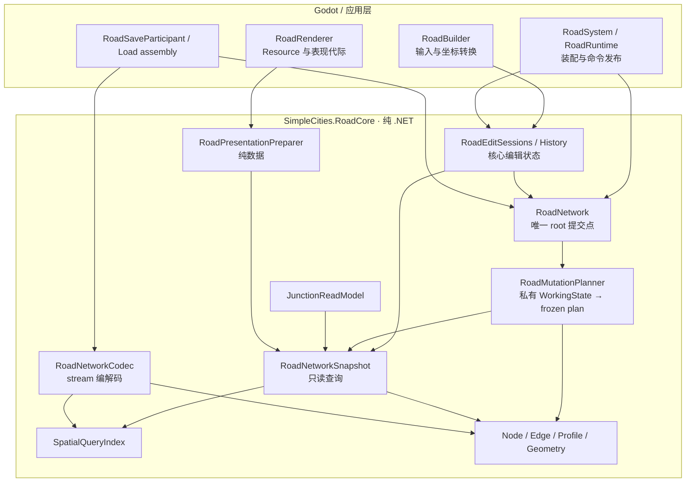
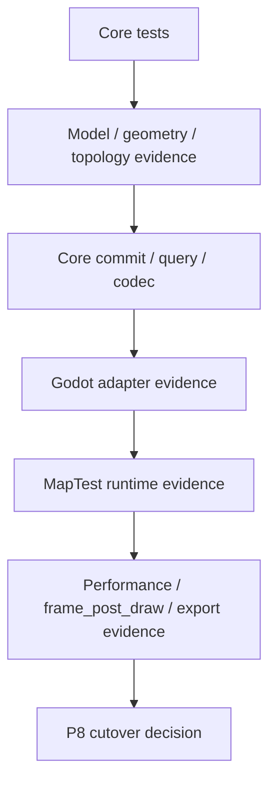

# 第四代道路系统重构指南

> 文档状态：重构设计与规格已确认，2026-09-12 更新。规格及22张纵向切片已发布；V4-01–13 与 V4-16 已完成实现与双轴审查，隔离场景支持单格删除与类型改造、闭环、格段选择、主格点与格心路口、重叠预览及后台操作控制，其余切片继续按阻塞关系推进。P0–P9/W0–W9 保留为模块覆盖与依赖参考，不代表 V4 路网已全部实现。
>
> V4 是一次破坏式重构。它建立新的道路核心、接口、数据模型和存档代际，最终由 Godot 适配层接入产品。V3 与第3.5代文档保留为历史基线，不代表 V4 已经实现。
>
> 后续道路重构以本指南为准，取代 V3.5 的渐进迁移顺序。开发期间 V4 在独立核心测试和验证场景中运行，正式主场景在验收后一次切换。旧缺陷作为 V4 回归输入，不要求先在 V3 修复整套系统。

## 1. 总体决定

领域用语以项目根目录的[道路词汇表](../../CONTEXT.md)为准；“格心路口”是原讨论中“半格路口”的统一称呼，“道路格段”是交互选择区间，“规范道路边（canonical Edge）”是结构节点之间的连续道路链。主要范围与模型取舍另见[米字网格范围 ADR](../adr/0001-v4-square-eight-grid-scope.md)和[格段选择 ADR](../adr/0002-grid-span-editing-and-canonical-edges.md)。这些记录不改变本指南尚未授权实施的状态。

本版范围已收敛为 **8 km × 8 km 地图上的米字型（方格八方向）道路**。1 个核心坐标单位 = 1 个 Godot 世界坐标单位 = 1 米；`CellSize` 表示以米计的主网格边长，当前配置为 100 米，不是一米一格。地图中心为原点。两条对角线在半格位置相交时自动形成可连通路口，格心路口只允许沿对角方向继续建设。当前只实现直线段及其折线链，不交付自由角度道路、其他网格或曲线算法；原曲线设计保留在 §3.3 作为未来资料。渲染目标为 144 FPS，道路计算由编辑命令触发并与渲染分离。普通编辑从玩家提交操作到看到结果的预算为 100–300 ms，计时定义见 §6.4。存档仅用于调试，不要求旧版本迁移。

当前 V3 已经建立了 canonical Edge、incidence、自环、平行 Edge、原生几何、不可变 revision、delta、token 和 prepared Load 等契约，但上一轮审计仍发现交点聚类排序、单段原生曲线自交、性能计数和非有限 bucket 参数问题。`RoadGraph` 仍同时承担规划、工作状态、索引、诊断、持久化和事件协调。`Scripts/Road/` 当前约 16,136 行，其中 `RoadGraph*.cs` 约 5,103 行，`RoadRenderer` 约 2,002 行。

V4 重新确定模块职责和依赖方向。下图箭头统一表示“调用方依赖被调用方”，核心不会反向依赖 Godot：



V4 采用一个新纯 .NET 项目 `SimpleCities.RoadCore`。核心不引用 Godot、场景树、`Resource`、`ArrayMesh`、`MultiMesh`、`SaveManager` 或 UI。Godot 项目只引用核心并承担输入、资源生命周期、显示和应用装配。

### 1.1 建议项目布局

以下是目标目录，当前尚未创建。先建一个核心程序集，职责通过 namespace 和访问级别隔离，不为每个小模块增加项目或 interface。

```text
src/SimpleCities.RoadCore/
  SimpleCities.RoadCore.csproj       # Microsoft.NET.Sdk / net10.0
  Model/                           # ID、实体、profile、不可变状态
  Geometry/                        # 米字网格线段、折线及数值策略
  Spatial/                         # fragment、派生索引
  Queries/                         # snapshot、RoadLocation、junction
  Mutations/                       # request、planner、draft、plan
  Editing/                         # history、与引擎无关的交互会话
  Serialization/                   # 有界流式 codec
  Presentation/                    # 纯数值样式、mesh/surface 数据

Scripts/RoadRuntime/
  RoadSystem.cs                    # 生命周期与依赖装配
  RoadRuntime.cs                   # 应用命令入口、通知和代际协调
  RoadBuilder.cs                   # Godot 输入 adapter
  RoadRenderer.cs                  # Godot 资源 adapter
  RoadSaveParticipant.cs           # 现有存档接口 adapter
  RoadLoadAssembly.cs              # 道路、工具、表现的 Load 装配

tests/SimpleCities.RoadCore.Tests/  # 不启动 Godot 的行为测试
tests/godot/                       # V4 引擎与交互契约
```

根 `SimpleCities.csproj` 默认递归编译 C#，因此接入独立项目时必须从根项目移除 `src/**/*.cs` 的直接编译，并通过 `ProjectReference` 引用核心。核心测试只引用核心项目；Godot 集成测试再引用应用项目。验证每个源码文件只编译到预期程序集一次。

`Serialization` 可以依赖 .NET `Stream`，不拥有文件路径、磁盘锁或槽位发布。`Presentation` 可以使用纯数值颜色和宽度定义，不引用 Godot `Color` 或 Resource。非道路的相机、UI 布局及文件系统恢复协议只在接入所需范围内调整。

## 2. 实施图

阶段框架采用一条核心主线，读取契约冻结后可并行推进写入与表现准备。所有箭头表示契约前置依赖，不表示新增写入路径。本图是模块覆盖参考，不按整层一次性交付；实际执行采用已发布的22张纵向工作项，先完成存档装配扩展、迁移和收拢，再逐项交付可验证的V4行为，见 §11.1。


| 阶段 | 主要工作流 | 输入 | 输出 | 必须停止的条件 |
| --- | --- | --- | --- | --- |
| P0 | 工程边界 | V3 稳定分支、当前项目文件 | 独立 core project、core tests、程序集规则 | core 仍引用 Godot，或源文件被重复编译 |
| P1 | 核心模型 | 无 | Node/Edge/Profile/Token/Snapshot | ID、profile、numeric policy 没有版本或 invariant |
| P2 | 几何 | P1 model | grid segment result、location、split witness | 半格交点、折线自交、重叠或预算拒绝没有确定结果 |
| P3 | 读取 | P1 + P2 | SpatialQuery、ReadSnapshot、Junction/Turn | consumer 需要直接访问 builder、bucket 或旧 GraphEdge |
| P4 | 写入 | P2 + P3 | MutationPlan、WorkingState、ChangeSet、commit | 失败需要修改活动 root 后回滚，或出现第二个写入点 |
| P5 | 历史与存档 | P4 change set | V4 codec、prepared state、bounded history | codec 修改活动 network，或 V3/V4 writer 并存 |
| P6 | 表现数据 | P2 + P3 | presentation snapshot、owner、mesh arrays | worker 创建 Godot Resource，或 surface 与 mesh 来源不同 |
| P7 | 引擎接入 | P3/P4/P5/P6 | Renderer、Input、SaveManager adapters | SaveManager 仍绑定 RoadGraph，或 UI 直接写核心 |
| P8 | 切换 | P7 全部通过 | V4 `RoadSystem`、V4 保存根、唯一生产路径 | V3/V4 双 runtime、双事件或双 writer |
| P9 | 收口 | P8 | 完整验证报告、删除旧生产文件 | 任一核心、runtime、性能、导出或清理门失败 |

### 2.1 并行安排

P0 和 P1 是共同前置契约。针对当前纵向切片所需的几何范围，先建立 P3 的领域读取契约，再推进 P4 写入规划与 P6 纯表现数据。P6 消费冻结的 read snapshot，不通过临时可写 facade 绕过 P3。P3 和 P6 都不能自行创建新的领域写入路径；P7 接入当前切片时依赖对应的核心、存档和表现契约。每个纵向切片只扩展其所需的契约范围，具体并行关系按已发布工作项判断，不把整套 P2 或 P5 完成误作所有早期演示的前提。

以下 W0–W9 用于核对模块覆盖，不再作为实际工单顺序：

```text
W0  Core project / solution boundary
W1  Core model / numeric policy / invariants
W2  Grid segment kernel / polyline self-intersection
W3  Spatial index / read snapshot / junction view
W4  Mutation planner / draft / change set / commit
W5  History / V4 codec / prepared load
W6  Pure presentation preparer
W7  Godot renderer / input / SaveManager host
W8  MapTest cutover / remove V3 road runtime
W9  Final QA and evidence
```

每个工作包结束时只做三件事：运行该包的 focused tests、运行受影响的回归门、记录新接口和证据。未完成的工作包不通过临时转发或手工场景状态标记为完成。

### 2.2 P7 的真实接入顺序

P7 不能只把 V4 类型塞进现有 `SaveManager`。当前 `SaveManager` 直接使用 `RoadGraph`、`RoadGraphRevision`、`RoadRendererPreparedLoad`、`SceneLoadContext` 和 `user://saves-v3`。V4 应按以下顺序拆开：

1. 把 `SceneLoadContext` 改为持有通用 network runtime、tool runtime、presentation runtime 和 slot target participant。
2. 把 `PreparedLoadWork` 改为通用 prepared network/presentation payload，不再出现 `RoadGraphRevision` 和 `RoadRendererPreparedLoad`。
3. 将 `SaveBaseDir`、required payload 和错误文案从 V3 常量改为 V4 storage policy。
4. 让 `RoadSaveParticipant` 负责 core codec 与现有 `IStreamingSaveable` 的转换。
5. 让 `RoadLoadAssembly` 负责 admission、preflight、reference swap、notification 和 cleanup plan 的组装。
6. 通过真实 V4 participant 后，才切换 `RoadSystem` 和 `ToolManager` 的持有类型。

这一顺序保证 SaveManager 只协调 participant，不知道道路实体的具体类型；它也使 V4 核心可以在没有 Godot 的测试中独立验证。

### 2.3 切换点和回退点

P8 之前，V3 是正式主场景的唯一道路 runtime，V4 只运行于 core tests、隔离验证场景和独立 V4 保存根。P8 需要形成一份切换清单：

- `RoadSystem`、`ToolManager`、`GameHUD`、`DebugPanel` 和 SaveManager 的引用已全部迁移；
- V4 network、renderer、input、history 和 save participant 在同一场景中只各有一个实例；
- 新旧保存根均可被单独识别，V4 操作不会触碰 V3 根；
- 切换前保留 V3 可运行分支，切换失败可以回到该分支；
- 切换后清理旧源文件前，再执行一次全量测试和导出文件扫描。

V4 从独立的新调试存档开始，不要求保留旧版本兼容性，不制作 converter，也不以旧城市继承为切换条件。普通运行时不能悄悄读取或转换 V3 存档；不兼容文件应明确拒绝。该决定不要求删除已有调试文件。

### 2.4 证据流



证据必须沿这条顺序积累。Core test 通过不能代替 Godot runtime；renderer runtime 通过不能代替 V4 codec；100K 压力结果不能代替 10K 连续交互门。每次性能报告都要分别列出 domain、worker prepare、preflight、reference commit、presentation commit、frame post draw 和端到端时间。

P8 切换前，必要的核心、隔离 V4 场景、存档、性能与导出证据必须已经具备；P9 对正式场景装配和旧生产路径清理后的结果执行回归复验，不是把这些验证第一次推迟到切换之后。


## 3. V4 的范围

### 3.1 必须实现

- canonical Node/Edge 模型；
- 强类型 `NodeId`、`EdgeId`、`RoadProfileId`；
- 米字网格的水平、垂直、两组对角方向线段及其折线链；
- 建造只采用按下确定起点、拖动预览、松开提交的手势；每笔沿一个合法方向，可跨多格，多笔相连形成折线；
- 正确处理开放 Edge、self-loop、parallel Edge、折线闭环、八字形和交点；
- 半格对角交点自动成为可连通的结构节点，半格起点只沿对角方向建设；
- 明确的几何容差、相交、共线重叠、无效输入和预算拒绝结果；
- 建造与已有道路发生正长度共线区间重叠时，不论 profile 是否相同均整笔拒绝，冲突预览标红；
- immutable network snapshot；
- planner、working draft、admission、change set 和一次性 commit；
- 只读道路查询 seam；
- 派生的 junction/turn read model；
- V4 独立 persistence codec；
- Godot renderer、输入会话、undo/redo 和异步 Load 适配；
- 删除和升级均按格段选择：按下选择、长按拖动累积、高亮预览、抬起后整笔提交；路口截断格段，不以整条 canonical Edge 作为最小编辑单位；
- 当前米字网格玩法所需的编辑、选择、撤销恢复、调试保存加载及失败保护能力；不以 V3 的全部几何能力作为等价验收条件。

### 3.2 暂不实现

交通流、拥堵、车辆行为、复杂寻路、信号灯、车道、桥梁、隧道、立交和高程道路不属于 V4 核心重构。V4 只提供足够稳定的 `JunctionReadModel` 和 `TurnMovement` seam，供后续系统读取。

V4 也不提前实现 renderer chunk。只有性能数据证明 global batch 成为实际瓶颈时，才建立带 generation 和 ownership 的 chunk 模块。

自由角度直线、六边形/三角形等其他网格，以及 Bézier、圆弧、圆锥曲线等曲线能力均不属于本版交付。不得为保留扩展描述而引入无消费方的曲线实现、占位运行时或强制曲线测试。

### 3.3 未来几何扩展资料（不计入本版实现与验收）

原设计计划覆盖六类原生几何：Line、CircularArc、CubicBezier、CubicHermiteSpline、Clothoid、RationalQuadratic。本版只保留满足米字网格规则的 Line 及折线链；其余类型及自由绘制模式在未来重新立项。有理二次曲线可作为圆锥曲线扩展的讨论基础，不代表本版已经提供其接口或算法。

未来曲线 kernel 的职责包括位置、切线、长度、bounds、split、canonicalization、reverse、line/curve/curve 求交、overlap、tangent、crossing、endpoint touch 和单段自交。自适应细分可作为研究起点，但结果必须区分命中、无命中、重叠、歧义、预算耗尽和 `Unresolved`，保留参数、位置及残差；不能把最大深度叶节点当作数学精确结果。届时需补充曲率范围、小/大坐标、近切、近重叠、反向几何及求交收敛验证。

原单段曲线自交流程保留如下，当前 Cubic Bézier 自交缺陷样例仅作为未来回归资料，不阻塞本版验收：

```text
segment
  -> parameter pair search (u, v)
  -> skip adjacent parameter band
  -> cluster positions
  -> create two split witnesses
  -> planner creates repeated crossing Node
  -> canonical Edge / self-loop result
```

本版继续将输入约束、几何运算、实体身份和表现职责分开，但不承诺未来增加曲线完全无需改变内部实现。恢复曲线工作时，必须重新审定 numeric policy、codec schema、查询和表现误差，不能仅因存在 `GeometryChain` 或参数位置就宣称已经支持曲线。

## 4. 核心数据模型

### 4.1 身份和状态

```csharp
readonly record struct NodeId(int Value);
readonly record struct EdgeId(int Value);
readonly record struct RoadProfileId(string Value);

readonly record struct RoadStateToken(
    long NetworkInstance,
    long Lineage,
    long ContentRevision,
    long ChangeSequence);
```

Node ID 和 Edge ID 使用独立命名空间。运行时 token 不写入存档，存档只保存实体身份、内容版本和 `nextNodeId`/`nextEdgeId` watermark。

以上代码仅展示数据形状。正式 ID 必须验证正整数，`default` 和零不作为有效身份；初始 watermark 为 1，耗尽时在提交前拒绝。一个 Node 和一个 Edge 可以具有相同数值，codec 和查询必须依靠类型区分。

同一 network 内 `ChangeSequence` 每次成功提交递增；undo/redo 可以恢复旧 `ContentRevision`，但 sequence 和 ID watermark 不回退。新分叉分配新 content revision；Load 采用存档 watermark、创建新 lineage；创建新的 network facade 分配新 `NetworkInstance`。历史 token、plan 和 `RoadLocation` 均不能跨这些身份重用。

### 4.2 Node、Edge 和端接

```text
RoadNode
  NodeId
  RoadPoint Position
  IReadOnlyList<EdgeIncidence> Incidences

EdgeIncidence
  EdgeId
  Endpoint A | B
  NeighborNodeId

RoadEdge
  EdgeId
  NodeA / NodeB
  RoadProfileId
  GeometryChain
```

`Degree` 等于 incidence 数。self-loop 对同一个 Node 提供 A、B 两个不同端接。parallel Edge 始终按 EdgeId 区分。Edge 方向用于 canonical 表示，不自动代表交通方向。

Edge 表示两个结构节点之间的最大连续网格折线链。折线转折和段连接处不自动创建 Node；真实交点、端点和 profile 变化形成结构节点。同 profile 的非结构性二度节点合并；不同 profile 保留。开放 Edge 按端点 ID 定向；自环在既定 seam 上选择稳定方向，反向时保留 A/B 角色映射。

核心 Edge 的存储边界不等于删除和升级工具的选择边界。即使十格连续道路已合并为一个 Edge，鼠标命中的单个格段仍须能独立删除或升级；planner 根据选中区间在需要处拆分、删除内容或改变 profile，再执行 canonicalization。不能为了支持格段选择而永久保留所有格点为结构 Node，也不能把鼠标命中的 EdgeId 直接解释成整条道路编辑。正常无路口道路以主网格间隔选择，路口进一步截断选择；格心路口两侧的半段分别可选，点击一侧不跨路口自动选中另一侧。

例如格长 100 米时，`(0,0)→(100,100)` 与 `(0,100)→(100,0)` 必须在 `(50,50)` 米建立同一个可连通路口，对应格坐标 `(0.5,0.5)`。主格点输入与自动生成的结构节点不是同一集合，不能因交点不在主格点而忽略它。主格点允许八方向建设；格心路口只允许沿穿过它的对角网格线继续建设，不允许横竖起建。这是建造方向约束，不额外规定未来交通系统的转向许可。

孤立纯环保留一个 rooted seam：新建闭环使用规范输入起点；由已有二度环收敛时使用其中最小 NodeId。仍有真实 junction 时，seam 随拓扑收敛到结构节点，不能仅因旧 NodeId 较小而阻止合并。相同规范内容的同一快照必须确定序列化；不同建造顺序可以分配不同 ID，不承诺任意提交顺序产生相同 JSON 字节。

V4-10 的单笔建造 API 每次接入一条直线，闭环由多笔已有道路连接形成，因此纯环规范化保留收敛前已有节点中的最小 NodeId。在该 seam 固定后，按链点坐标的字典序比较正反两个方向，选择稳定方向；普通二度 seam 遇到真实分支时仍须合并到结构节点。reader 验证载荷中既定 seam 的几何和方向，不从存档推测已经消失的建造历史。

`RoadProfileId` 负责稳定语义身份；显示名称、颜色、宽度和材质属于 presentation catalog。速度、容量、费用等字段只有在有实际消费方和正式 schema 后才进入 profile。

首版使用版本为 1 的不可变内置 catalog，包含 `dirt`、`street`、`arterial`、`highway`。profile ID 已被建造、改造、merge key、读取和 codec 实际消费；暂不提供运行时自定义 profile。payload 保存 catalog version 和 Edge 的 profile ID，不保存样式 Resource。未知版本或 ID 在 Load 前拒绝，不能以默认街道代替。道路显示宽度暂属样式单位，不能作为车道数或通行容量。

四种道路类型允许双向任意互换，包括从 highway 改为 dirt；“升级”工具在本版表示道路类型改造，不施加只能向上升级的等级顺序，也不引入费用、解锁或额外经济规则。同目标类型按 §5.2 静默跳过，类型修改仍遵守格段范围与批量提交规则。

### 4.3 数值模型

V4 设计基线采用 binary64 的独立 `RoadPoint`/`RoadVector`，核心坐标以米计。**1 核心单位 = 1 Godot 世界单位 = 1 米**，引擎 adapter 只进行 binary64 到 binary32 的数值转换，不额外乘以 100。相机缩放改变屏幕上每米占多少像素，不改变世界单位的物理含义。地图覆盖 8000 m × 8000 m，以中心为原点，X/Y 坐标范围均为 `[-4000,4000]` 米。

`CellSize = c` 表示主网格边长为 `c` 米。2026-09-11 核对 `scenes/road_config.tres`，当前值为 `100.0`，因此水平或垂直跨一格长 100 米，对角跨一格长 `100 * sqrt(2)` 米（约 141.421 米）。半格中心相对格角在两个轴上各偏移 50 米，不是偏移 0.5 米。当前格长下地图每边 80 格，共 6400 个方格区域。格长是地图创建参数，首版只提供 **25、50、100、200 米**四档，默认 100 米，创建后固定并写入存档；调试其他格长时创建新地图，不重新解释或缩放已有路网。四档均整除地图半宽 4000 米，使中心网格原点与地图边界对齐；reader 拒绝其他格长。

以下名词必须分开：主格点的格坐标为整数 `(i,j)`，相对网格原点的米制位置为 `(i*c,j*c)`；格心坐标为 `(i+0.5,j+0.5)`，对应 `((i+0.5)*c,(j+0.5)*c)` 米。结构节点是端点、路口或 profile 分界，允许落在合法格心。Godot 世界坐标与核心米制位置采用相同单位，屏幕坐标另由相机变换得到。网格输入身份由离散网格规则确定，不通过显示浮点坐标相等来判定。NodeId 仍是实体身份，不等于坐标键。

当前 100 米格长下，主格点和格心的米制坐标都是整数；25 米档的格心可能具有 12.5 米轴向偏移。首版四档产生的整数或半整数米坐标在本地图范围内均可被 binary64 和 binary32 精确表示；对角长度、归一化法线、道路宽度偏移和相机变换仍会舍入。未来若扩展其他格长，必须单独验证误差，不能直接沿用四档的结论。

在已确定的地图原点和单位约定下，地图边缘绝对坐标 4000 米附近，binary32 的相邻可表示值间距约为 **0.244140625 毫米**；binary64 约为 **4.54747 × 10^-10 毫米**。相邻值间距不是整个显示链的误差上限，单次最近舍入通常不超过半个间距；不能据此保证矩阵运算、输入反算和整个帧的累计误差。当前 8 km 尺度没有仅凭坐标数量级就必须采用动态局部原点的证据，仍需验证地图边缘、最大缩放及最小显示细节。

**已确认的半格规则：**主格点可沿八方向建设，格心只可沿穿过它的对角网格线建设，保持当前 `SquareEightRoadInputStrategy` 的方向限制。不得从格心横竖起建并继续生成四分之一格等非本版格网位置。半格表示的是 `c/2` 的轴向偏移，而不是固定半米；离散键的表示方案、完整合法性检查和数值误差容限在后续设计中确定。

**已确认的边界规则：**拖拽越过地图边界时，预览终点停在当前合法建设方向上、边界内最远的合法格点，不把任意矩形裁剪交点当作道路端点。从格心起建时仍遵守对角方向限制；没有正长度合法延伸时不能提交。最终提交与预览采用相同的受限草稿，核心独立拒绝越界请求。首版限制道路中心线和合法建设位置，允许路面宽度、端帽及路口表面在边界自然伸出，不为此引入表现网格裁剪；伸出的表面不产生界外结构节点或合法建造起点。表现 mesh 与 surface owner 仍使用相同几何，不能只裁剪点击数据而保留画面。

P1 必须固定：

- finite 和坐标范围；
- canonical zero；
- 网格合法起点/方向、地图边界及几何长度范围；
- 空间误差和参数误差；
- binary64 exact-sign predicate 的使用位置；
- 非法网格几何、数值失败和工作预算超限的明确拒绝结果。

binary64 是对 V3 数值表示的明确变更；米制解释保持现有 Godot 坐标数值，不进行百倍坐标缩放。原有 binary32 exact-sign 代码需要重新实现或验证，旧阈值须按米制、格长和新精度复核，不能未经测量直接照搬。P1 记录坐标上限、snap 半径、cluster 直径、长度和工作预算的实际数值；P2 验证地图中心与边缘、半格交点、共线重叠、反向线段及输入边界，未确定这些数值前不得进入拓扑集成。

引擎转换记录误差并检查有限性。可见 mesh 和 surface query 必须共用转换后相同的顶点，防止二者分别舍入；核心精确查询始终使用 binary64 原生几何。过小道路在大坐标下无法可靠呈现时，要在表现预检中明确拒绝或采用经过验证的局部原点转换。

统一使用 `RoadLocation(EdgeId, GeometryIndex, Parameter)` 表示路网中的点，用 `RoadLocationSpan` 表示同一线段的参数区间。Geometry Kernel 的点结果只含参数、位置和残差，由查询或 planner 绑定 EdgeId。位置随来源 `RoadStateToken` 使用，split/merge 后不得继续解释旧参数。显示 span 插值得到的 location 是表面命中的来源定位，不能直接冒充核心中心线最近点；未来曲线同样需要保持这个区分。

## 5. 模块设计

### 5.1 `RoadNetwork`

这是核心唯一写入模块，持有当前 immutable snapshot。规划与提交是两个明确阶段：

1. `Plan` 根据捕获的来源 snapshot/token 调用 planner，生成冻结的目标快照、变更集和预算信息；不修改活动 root、ID watermark 或 history。
2. 应用装配可以读取该冻结目标快照，完成 §6.2 的纯表现准备及 Godot 资源预检；核心库不读取资源对象或等待主线程。
3. `Commit` 在统一协调点重新校验 base token、取消状态及预先准备的资源/历史准入结果，拒绝已经过期或取消的 plan。
4. 校验通过后，核心一次交换 snapshot 并协调已准备的历史状态，返回 `RoadChangeSet`；应用层随后发布对应的已准备表现。

两阶段并不形成两个写入口：`Plan` 只能构造私有数据，只有 `Commit` 发布活动核心状态。最终提交不重新规划几何或分配大块数据；history 的准入与更新必须在提交前准备，不能仅靠提交后可能失败的事件订阅者维护一致性。无变化结果直接结束，不进入表现重建或提交。

核心不要求调用者订阅 Godot 风格事件。应用层在成功 commit 后发布一次变更通知。通知必须携带 before/after token、created/removed/updated ID 和 full-reset 标志。核心 commit 不执行 observer、Godot 操作或等待；应用层 observer 失败不能改变已经提交的核心状态。

### 5.2 `RoadMutationPlanner`

planner 接收 immutable snapshot、request 和 numeric policy，创建私有 `RoadWorkingState`，返回完整且已冻结的 plan。plan 包含：

- 规范化后的输入几何；
- incoming/existing intersection witness；
- overlap 和 self-overlap 结论；
- split、merge、Node/Edge 创建和删除计划；
- 预计资源、候选和 witness 数量；
- before token；
- after snapshot 或可验证的 after state；
- `RoadChangeSet` 和资源预算。

planner 不读取活动 facade 的 mutable 字段，不触发事件，不创建 Godot 对象，也不在 commit 后继续补工作。需要多步 canonicalization 的算法全部在私有 draft 内完成；`RoadNetwork` 只接纳 base token 仍然匹配且预算通过的冻结 plan。

建造请求与已有道路中心线存在正长度共线区间重叠时，planner 返回明确的重叠拒绝及冲突区间；同 profile、不同 profile、反向重绘、部分覆盖和完全覆盖遵守相同规则。不能跳过覆盖部分后提交余下道路，也不能隐式升级已有道路。点交叉和仅端点接触不属于区间重叠，继续按路口与连接规则处理。拒绝不产生 snapshot swap、history 条目或 ID 消耗。

删除和升级 request 表达同一来源 token 上的一组道路位置区间，升级另附目标 profile，而非只有 EdgeId 集合。一次拖动抬起时提交全部已选择区间，planner 在私有草稿中完成所需 split、delete 或 profile change 及 canonicalization，再一次发布。局部删除保留同一 Edge 未选中的其余区间，不能直接 detach 整条 Edge。选择区间的合并、去重和来源校验不能依赖已被 split/merge 改写的活动 ID；每次有效手势形成一次 change set 和一次可撤销操作，不能逐格提前写入活动路网。

升级只改变与目标 profile 不同的选中区间，同目标 profile 区间直接跳过，不为跳过部分执行无意义 split/merge。整笔没有实际变化时返回明确的无变化结果供调用方收尾，不交换 snapshot、不递增 token、不消耗 ID、不发布变更事件，也不新增 undo/redo 条目。界面静默结束，不提示“已是该类型”。混合选择中的实际变化部分仍作为一笔提交及一条历史记录；这不改变建造工具统一拒绝重叠的规则。

### 5.3 `RoadWorkingState`

working state 是 planner 或 network 在提交前使用的私有可变草稿。它集中管理实体表、incidence、ID reservation、派生索引和资源计数。草稿完成后生成 immutable snapshot；失败则直接丢弃草稿。

这取代当前 `RoadGraph` 内部的多个 builder、计数器和恢复路径。V4 不把可写 builder 暴露给 renderer、input、history 或存档。失败时丢弃 draft；不依赖把活动 root 改坏后再执行恢复。

working state 不能直接负责“所有权限”。它只接受 planner 已确定的操作，执行前后都运行 core invariant。ID reservation、资源预算和 history admission 失败时，活动 root、sequence、watermark 和 change set 均保持不变。

### 5.4 Geometry Kernel

本版 Geometry Kernel 只处理米字网格线段及折线：

- 几何段的位置、切线、长度、bounds 和 split；
- canonicalization 和 reverse；
- line/line 相交；
- 共线 overlap、crossing、endpoint touch；
- 折线不同线段之间的 self-intersection；
- 显示层之外的 `GeometryLocation`。

同一套 kernel 必须服务 mutation、Load validation、read query 和 presentation preparation。结果必须区分命中、无命中、重叠、无效输入、数值失败和预算超限；不能把计算失败作为空命中列表返回。正常合法网格输入必须有成功样例门，不能以大量拒绝替代正确实现。本版不迁移曲线自适应细分或曲线求交收敛算法。

V4 的核心库暂不设置 `IGeometryKernel` 这样的公共 interface。只有第二种实际算法需要在同一个消费点替换时，才建立 adapter seam；测试使用确定输入的纯函数和小型 fixture，不为抽象而增加一层转发。

单条非退化直线段不存在本版需要搜索的内部自交；折线自交需要识别不同线段的参数见证，并由 planner 一次建立结构节点及切分结果。原单段曲线自交流程已移至 §3.3，仅供未来参考。

### 5.5 `SpatialQueryIndex`

空间索引是派生结构，只提供粗筛 candidate，不决定道路是否相交。它必须：

- 拒绝非有限 bucket size、坐标和 bounds；
- 为长 geometry 使用有界 fragment；
- 保留 Edge、geometry index、参数区间和端点所有权；
- 对半径、矩形和 geometry 查询返回明确的 candidate metrics；
- 允许从 snapshot 完整重建；
- 不把显示采样点当作权威几何；
- candidate 超限时返回 `QueryBudgetExceeded`，不静默退化为全图扫描。

V4 的 metrics 至少分开记录 bucket visited、fragment candidates、exact geometry tests、full Edge visits 和结果 Edge 数。结果数量不能代替候选数量。空间索引查询返回 `SpatialQueryResult<T>`，包含 token、结果、候选统计和拒绝原因；调用者不再通过内部计数器猜测查询是否走了全表。

### 5.6 `RoadNetworkReadModel`

所有消费者通过 `IRoadNetworkReadModel` 读取：

- Edge/Node view；
- incidence 和端点切线；
- Edge 的 `GeometryLocation`；
- nearest/near/intersection 查询；
- connected Edge 的稳定排序；
- token-bound snapshot。

返回值不暴露工作 builder、bucket page、Godot 类型或 renderer cache。`RoadSurfaceSnapshot` 是表现层读取模型，不能替代核心道路 read model。核心 read model 的 public contract 不返回 `GraphNode`/`GraphEdge` 具体可变实现，旧测试通过 snapshot view 或 test codec 读取。

### 5.7 `JunctionReadModel`

它从同一个 immutable snapshot 派生，不持久化，也不修改道路图。每个 `JunctionView` 保存：

- NodeId 和位置；
- 端接 EdgeId、Endpoint、profile 和出射切线；
- 稳定排序；
- 端接之间的 `TurnMovement`；
- 转向角和几何关系；
- 来源 `RoadStateToken`。

self-loop 必须产生 A→B、B→A 等可区分 movement。parallel Edge 不能通过 `NeighborNodeId` 去重。V4 第一版只产生几何上的 movement 描述和稳定 ID，不擅自判断红绿灯、容量或车辆许可。该模型先服务诊断或路口可视化，之后再由交通系统消费。

### 5.8 Persistence Codec

V4 使用新的 `simple-cities-v4` format family 和新的保存根，例如 `user://saves-v4/`。V4 payload 至少包含：

```json
{
  "formatFamily": "simple-cities-v4",
  "payloadType": "road-network",
  "schemaVersion": 6,
  "contentRevision": 1,
  "nextNodeId": 1,
  "nextEdgeId": 1,
  "profileCatalogVersion": 1,
  "map": {
    "widthMetres": 8000,
    "heightMetres": 8000,
    "origin": "center",
    "metresPerUnit": 1,
    "grid": "square-eight",
    "cellSizeMetres": 100
  },
  "nodes": [],
  "edges": []
}
```

Node、Edge 等实体按稳定 ID 排序，Edge 内线段保持规范几何链顺序。reader 只接受规范格式，拒绝未知字段、重复字段、错误 profile、悬空 endpoint、内部未建 Node 的交点、错误 self-loop seam、越界或不符合本版网格规则的几何；曲线和其他未支持的几何类型必须拒绝。当前内置 profile catalog 的四个 ID 固定为 `dirt`、`street`、`arterial`、`highway`，catalog version 不等于 schema version。米制、地图尺寸和网格规则属于带版本的格式契约；payload 还须保存该地图创建时固定的格长，加载使用存档格长完成几何验证及输入装配，不能使用当前新建地图默认值重新解释已存坐标。

V4-10 使用 schema 6，拒绝旧 schema 1/2/3/4/5，不提供迁移器。地图两轴固定为 -4000 至 4000 米，格长只接受 25/50/100/200 米，初始内容版本和两类 ID watermark 均为 1。载荷上限为 1 MiB，JSON 深度上限为 6；所有对象拒绝缺失、未知和重复字段。当前接受空图及多个路网组件，支持主格点或格心路口、闭环、自环和同端点间不同路径的平行边，可包含不同道路类型的多条规范道路边。节点字段为 `id/x/y`；道路字段为 `id/startNodeId/endNodeId/profile/points`，points保存包含首尾端点的有序 `x/y` 链点。实体按ID稳定排序，开放边从较小端点ID指向较大端点ID，自环按 §4.2 的既定 seam 选择稳定方向；reader检查水位、端点、合法主格点/格心、格心只沿对角的方向规则、必要类型分界和共同节点交叉，拒绝未节点化交点与重叠。同类型非结构二度连接必须合并，纯环保留一个 rooted seam，冗余共线点不保留。

本阶段显式限制为512节点、256边、2048链点；这是有界实现预算，不表示最终路网容量或性能目标已验证。主格点与格心交叉已形成真实路口，闭环可与分支连接；共线重叠已统一整笔拒绝，并返回本次草稿的准确冲突区间。位置参数在一条规范道路边的完整折线上按弧长归一化，不能把它当作端点之间的直线参数。自环的起终端接即使引用同一 EdgeId，也按 Start/End 角色分别读取并分配表面来源；不同路径平行边保持独立 EdgeId。

运行时实例身份、lineage 和变更序列不写入文件；Load 保留内容版本及 watermark，创建新 lineage 并递增当前实例的变更序列。持久化水位与内容版本必须小于 `long.MaxValue`，建造准入确保递增后的值仍可被reader接受，耗尽在提交前拒绝。

隔离场景使用 `user://saves-v4/<slot>/road_network_v4.json`，载荷格式族为 `simple-cities-v4`。槽位 manifest、完整性校验、锁和磁盘发布事务继续复用现有 `SaveSlotStore` 容器协议，其内部仍有 V3 命名；这不表示 V4 codec 接受 V3 道路载荷，也不表示当前已重写槽位容器格式。

存档仅服务快速迭代中的调试复现。V4 不读取或转换 V3 数据，也不制作离线 converter；后续格式改变可以提升 schema version 并拒绝旧文件，无需承担跨版本兼容。当前版本仍须确定性 round-trip；坏文件或加载失败不得污染活动场景，保存失败不得破坏已有槽位。格式不兼容必须给出明确原因，不能伪装成空地图或自动回退默认值。

## 6. Godot 适配层

### 6.1 输入

`RoadEditController` 负责将输入映射为核心 request。现有 Placement、Removal 和 Upgrade session 可以保留交互语义，但只保存 token-bound read snapshot 和用户选择，不直接读取核心内部集合。它不再同时承担 RoadGraph mutation、history admission 和 renderer token 判断；这些信息由核心结果和 presentation adapter 返回。

当前只接入米字网格策略。首版同一时刻只允许一笔未完成的道路编辑，不排队提交后续建造、拆除、升级或 undo/redo。等待期间相机、光标和下一笔非提交预览继续响应；预览若依赖旧路网必须标明其暂定状态，提交前重新绑定当前 snapshot。完成包括核心提交与对应表现发布；表现失败时按 §6.2 暂停道路编辑并提供手动重试，不能释放编辑门后允许旧画面继续修改新路网。Load 与正在处理的编辑通过统一操作状态互斥。Esc 取消按 §6.4 的提交边界执行，不在提交后自动撤销或补偿恢复道路。

**已确认的建造手势：**鼠标主键按下时确定合法起点，按住拖动时显示一个合法方向上的直线预览，可跨多个网格间隔，松开后整笔提交。主格点使用八方向、格心起点仅使用对角方向，越界终点按 §4.3 约束。拖动改变当前预览方向，不沿鼠标轨迹累积折点。建造成功后结束本次手势，不自动以终点启动下一笔；转弯道路由玩家从已有端点另起一笔实现。未形成正长度合法草稿时松开不建路，也不保留会话等待后续点击。首版不迁入多次点击折线、Enter/双击确认等旧建造模式；这不改变核心对多段折线、闭环和自交路网的支持。

**已确认的删除与升级手势：**两种工具均以鼠标命中的道路格段为选择单位。按下时选中命中格段；保持按下并拖动时累积沿途命中的格段，重复经过不重复加入；选择期间高亮完整影响范围，仅修改会话选择，不删除或升级活动路网。抬起时冻结选择并发出一次批量删除或升级请求。单击即按下后抬起，作用于所命中的一个格段。未命中的同一格内其他道路不自动一起选中；不能把“选中一个格子”解释为修改整个方格区域内的所有分支。一次删除手势与一次升级手势均对应一次撤销。

一条无路口长道路横跨多个主网格间隔时，点击中间只删除或升级相应格段，不作用于整条 canonical Edge。路口截断格段选择：例如 100 米格长下，`(0,0)→(100,100)` 在 `(50,50)` 有路口，点击前半段只选 `(0,0)→(50,50)`，其长度约 70.711 米，不自动选路口另一侧。拖选可以分别经过并累积两侧区间。拖动采样必须覆盖鼠标轨迹经过的可选格段，不能仅依赖每个渲染帧的鼠标落点而漏掉快速移动途中的格段。本节只确认按下、拖动、抬起提交及路口截断的行为，不据“参照都市天际线”推导额外游戏功能。

**已确认的路口选择规则：**鼠标移向能够明确辨认的道路分支后，才预选或累积选中该分支上的格段。路口中心不能明确归属某个分支时，不新增选择，已累积的选择保持不变。拖动穿过路口不自动扩散到其他相连分支；不能仅因路径经过共享 junction patch 或命中 NodeId 就选择全部 incident Edge。高亮必须显示实际将作用的道路区间，不能只显示路口标记让玩家猜测选中了哪条路。

**高亮是必要交互反馈：**未按下时对可操作格段显示悬停预选高亮；按下后，已经累积的格段保持选择高亮，鼠标离开也不消失，直到本次手势完成或取消。悬停预选与已选择状态应可区分，且均限定到格段/路口截断后的区间，不高亮整条底层 Edge。抬起后后台处理中保留能准确对应本次操作的范围反馈，实际路网仍由提交结果决定；成功完成或取消后清除该手势的选择高亮。重叠建造的红色冲突预览是另一种状态，不与可执行选择混用。具体颜色、透明度及轮廓样式在视觉设计和运行时验收中确定。

升级经过已经是目标类型的格段时静默跳过，不弹提示，不将其高亮成待改变区间；拖选仍可继续累积其他需要改变的部分。整笔没有变化时静默清理会话选择，不留下等待状态、变更或撤销记录。

越界拖拽按 §4.3 将预览终点约束到合法格点，预览与提交使用同一份几何草稿。建造与已有道路发生正长度共线区间重叠时，无论同类型还是不同类型、部分覆盖还是完全覆盖，都拒绝整笔建造。延伸道路应从已有端点起建；改变类型使用升级工具，不通过重叠建造完成。

**已确认的重叠预览规则：**本次草稿的冲突区段标红，已有道路保持原样，同时显示“与现有道路重叠”等原因，整笔操作不可提交。不能在玩家不知情时仅建造剩余部分，也不能因全部重复而创建空的撤销条目。正常十字/斜向交叉、半格交点和仅端点连接不能按共线重叠标红；道路显示宽度的交叠也不自动等于中心线区间重叠。预览检查尚未完成或版本过期时，不把它显示为已经确认可建；最终提交仍由核心按同一规则校验。

2026-09-11 源码核对：当前建造预览是白色半透明虚线，提交时才返回拒绝原因；已有道路完全覆盖时拒绝，部分覆盖时跳过覆盖部分，覆盖判断不区分 RoadType。上述红色非法预览和统一拒绝重叠属于已确认的 V4 设计变更，尚未实现；相关 V3 测试不能直接作为 V4 行为期望。

提交路径统一为：

```text
InputEvent
  -> Session
  -> RoadMutationRequest
  -> RoadNetwork.Plan (private frozen target)
  -> Pure presentation prepare / Resource preflight
  -> Revalidate token / cancellation / admission
  -> RoadNetwork.Commit
  -> RoadChangeSet
  -> Publish prepared presentation / change notification
```

History 的准备和最终状态发布与核心提交协调，不是最后一行的普通通知消费者。预检或取消失败只丢弃私有目标与未发布资源；无变化操作在规划阶段结束。

UI 不能创建 Node、Edge 或 profile，也不能直接调用 renderer 的 surface geometry 来决定领域拓扑。renderer surface 提供玩家命中当前可见道路的来源位置，读取与交互层据此确定对应道路格段；命中的 EdgeId 只是来源身份，不代表选中了整条规范道路边。最终领域合法性仍由 core planner 判断。

### 6.2 表现

`RoadPresentationPreparer` 接收 read snapshot 和 presentation catalog，生成纯数据：display points、ribbon vertices、surface primitives、owner、`RoadLocation` 和 presentation metrics。

`RoadRenderer` 只负责：

- Godot Resource 创建和释放；
- desired/presented render token；
- deferred rebuild；
- stale result 拒绝；
- hidden Resource Preflight；
- final reference commit；
- provider 查询。

普通 rebuild 与 Load 必须共用同一个 pure preparer。`ArrayMesh`、`MultiMesh` 和 scene tree 操作不得进入核心或 worker preparation。

核心发布后可以继续显示上一份完整表现，但 mesh、surface owner 和点击 location 必须来自同一个 presented token。展示旧版本不等于可以将旧 location 用于新核心；必须经过 token 校验和重新规划。资源创建失败属于表现失败，不得将已经成功的核心提交伪报为建造失败；已提交内容可被保存，history 也必须与其保持一致。

**预防优先：**正常编辑应基于冻结的目标快照，在核心提交前完成纯表现准备、顶点/索引/owner 校验、资源预算检查及能够提前执行的 hidden Resource Preflight。Godot 资源预检仍在允许的主线程阶段完成，并受每帧预算约束；不能为了后台化而在 worker 创建 Resource。预检失败则不提交核心；取消或 token 失效则丢弃预备结果和未发布资源。核心提交后的发布路径尽量只交换已准备的引用和状态，不重新进行几何计算或批量资源创建。应用层协调这些准备工作，核心仍不依赖 Godot。

正常合法输入和规定压力范围内，不应把“显示失败后点重试”当作正常编辑流程；确定性的网格、owner、资源生命周期错误必须在切换前修复。预检不能保证设备丢失或内存耗尽等外部故障绝不发生，因此保留异常处理入口，但不以它代替正确性验收。

**已确认的表现失败处置：**若核心已经提交、表现仍未能发布，保留最后一份完整画面，暂停道路建造/删除/升级及依赖当前表现的操作，显示“道路显示更新失败”和“重试”按钮。相机继续可用，允许保存已提交的核心数据供调试。重试只为当前已提交 snapshot 重新准备并发布表现，不重新提交原编辑、不分配道路实体 ID、不改变核心 token，也不增加历史记录；重复点击不能并发启动多个重试。重试成功后再恢复道路编辑，失败继续保持明确的异常状态，不无限自动重试或静默恢复旧路网。若图形设备本身已不可用，不能保证旧画面仍能绘制，该情况不能伪称成功保留画面。

故障验证分别覆盖提交前预检失败、提交后发布失败、手动重试成功/失败及晚到结果；必须同时检查路网是否改变、画面/owner 是否一致、历史是否重复，以及编辑禁用和保存可用的状态。V4-17已验证Load提交前预检失败、通知异常和晚到预览；V4-18已补齐普通编辑及Load首帧显示失败、旧画面保留、手动重试和跨代结果丢弃的代表性验证。

### 6.3 存档装配

新增 `RoadSaveParticipant` 将核心 snapshot/prepare state 适配到现有 `IStreamingSaveable`。`SaveManager` 和 `PreparedAggregateLoad` 继续管理操作 token、scene generation、文件锁和多 participant 协调。

commit plan 必须满足现有 `INonThrowingLoadCommitPlan` 的真实含义：

- `CommitReferences()` 不抛异常；
- 不 yield；
- 不创建 Resource；
- 不读写文件；
- 不调用用户回调；
- 只交换已准备引用和状态。

如果未来 participant 无法满足这些条件，先重新设计 rollback 协议，再加入 aggregate，不能继续扩大“全有或全无”的承诺。

### 6.4 渲染节奏、后台工作和表现滞后

渲染目标为 144 FPS，整帧预算约为 `1000 / 144 = 6.9444 ms`。道路规划及纯表现准备由命令触发，在后台读取不可变快照；它们不需要按 144 Hz 重算。未来持续模拟可使用独立固定步长，但本版不引入交通模拟频率。主线程发布经版本检查的结果并管理 Godot 资源，渲染在等待期间继续使用完整的已发布表现。`CallDeferred` 仅表示延后调用，不等于后台计算。

计算与渲染分离仍需约束主线程资源创建、上传、内存分配和后台资源竞争。不能用后台耗时不计帧时间的说法掩盖主线程长任务，也不能仅以 `run/max_fps=144` 证明达标。道路拓扑按完整版本切换，不对新增/删除/切分过程进行插值。

普通编辑的 **100–300 ms 预算约束玩家提交操作到看到正确结果的端到端延迟**，并非必须延迟至少 100 ms。计时从触发提交的输入事件开始，至包含该命令结果的完整表现第一次 `frame_post_draw`；预览变化不算提交结果，不能从后台开始执行或核心提交时重新起算。100 ms 为期望目标，300 ms 为上限目标；分位数、典型命令规模及严格超限判据将在后续验收设计中冻结，当前不是性能已通过的声明。输入到核心提交、后台准备、资源预检、引用交换和核心提交到绘制的表现滞后仍分别记录，所有等待均计入端到端时间。`frame_post_draw` 是引擎完成绘制的观测点，不代表显示器物理扫描完成。

144 FPS 下 100–300 ms 约覆盖 14–43 个渲染帧，因此不能采用“版本落后一两帧就失败”的统一规则。这是整个编辑流程的总预算，不能给后台计算和提交后表现各分配一份 300 ms。删除与升级手势从抬起触发提交开始计时，玩家按住拖动选择的时长不计为后台延迟，但选择反馈须保持渲染响应。所有延迟记录毫秒、渲染帧数、desired/presented token 和失败原因；端到端超过 300 ms 继续处理并提示等待，尚未提交时提示 Esc 取消，已提交时只提示更新显示，不因超时自动取消，也不把单纯超时伪报为计算失败。任何一帧的 mesh/surface/token 混用仍然是正确性缺陷，不享受时间宽限。资源已就绪后的额外调度等待应单独记录，不能被后台耗时掩盖。

**已确认的取消边界：**按住选择期间 Esc 清空本次选择；抬起进入计算或预检后，只要核心尚未提交，Esc 可以取消，不必等待超过 300 ms 才生效。耗时计算和可预检工作尽量置于提交前，最终同步提交不可中断。取消与提交由统一协调点确定先后：取消先被接受则禁止提交，提交已经发生则不能再报告“已取消”。

接受取消后立即使该操作的晚到结果失去发布资格，并请求后台退出；清理尚未完成时可以显示“正在取消”，清理完成并可安全恢复编辑后再报告“已取消”。取消不得改变活动路网、ID watermark 或产生变更历史。取消响应及资源清理的时间预算在后续验收设计中确定，不采用强制中止线程来制造立即完成的假象。

核心已经提交后，Esc 不再取消该操作，系统继续完成对应表现，提示改为“正在更新显示”，不再显示“Esc 取消”。本取消流程不提供提交后的撤销、补偿或恢复原路网，也不将自动 undo 作为收尾步骤；不能只丢弃显示任务就声称取消成功。表现失败应准确报告并处理资源状态，不能伪报道路已恢复。

独立的编辑 undo/redo 继续保留，作用于已完成的操作；本节“不恢复”仅指 Esc 在提交后不恢复原路网，不移除正常撤销/重做功能。Esc 不自动转换成 undo 请求，也不改变 history 的一次有效手势对应一次撤销的规则。

10K 连续交互门改为以 144 FPS 为渲染目标，帧时间 P95 预算约 6.94 ms，同时报告 P99、最大值和超预算帧，避免 P95 掩盖明显卡顿。10K 的计数对象、典型编辑规模、测试硬件、渲染设置和采样窗口尚待定义；100K 保留为候选压力规模，必须先核对其在最终格长和合法路网规则下是否可构造，不能混入非法几何凑数量。8 km × 8 km、100 米格长对应 80 × 80 = 6400 个方格区域，不等于 6400 条道路；网格显示、道路实体数量和空间索引覆盖分别度量。

## 7. 实施阶段

### P0：冻结 V3 和建立新项目

保留 V3 分支和当前测试基线。创建 `SimpleCities.RoadCore` 与独立 core tests。当前 V3 的 959/959、Debug/ExportRelease build 和已记录 runtime 证据只作为基线，不混入 V4 通过数。P0 先验证新的程序集边界：核心可以独立编译，根 Godot 项目不重复编译核心源文件，核心测试不加载 Godot。

P0 同时登记当前已确认问题：交点 cluster 空间排序、空间 metrics、非有限 bucket 和旧类参考文档。与米字网格有关的问题作为 V4 回归输入；单段曲线自交样例仅保留为 §3.3 的未来资料，不要求本版修复或迁移曲线实现。

### P1：模型和 numeric policy

完成强类型 ID、`RoadPoint`、Node、Edge、incidence、profile identity、token 和 immutable snapshot。建立所有核心 invariant，暂不接 Godot。P1 不实现交点、空间索引和存档，只建立它们之后必须消费的内容模型。

### P2：Geometry Kernel

实现米字网格线段及折线的 canonicalization、reverse、split、可靠 sign、容差查询、共线 overlap、端点接触和折线 self-intersection。必须覆盖半格对角路口、反向重复绘制、地图边缘以及已确认的合法起点规则。数值失败和预算超限不能作为空结果返回；曲线算法和 Cubic Bézier 自交夹具不属于本阶段交付。

### P3：Spatial index 和 Read Model

建立 fragment index、局部查询 metrics、`IRoadNetworkReadModel` 和 `JunctionReadModel`。验证远端 Edge 增长不会改变固定局部查询的 exact work；同时记录大矩形、长斜线和高密度 junction 的真实成本。先让一个实际诊断消费者使用 read model，再扩展到 renderer 和输入，避免接口成为没有消费者的薄适配器。

### P4：Planner、WorkingState 和 Commit

实现 path submission、split、merge、delete、profile change、容量 admission、`RoadChangeSet` 和 token 校验。成功命令只能产生一次 snapshot swap；失败只能丢弃 draft。一个 request 先在私有 working state 中完整规划，再一次发布；禁止复用 V3 的“修改活动 builder、失败后恢复”作为 V4 公开流程。

delete 和 profile change 支持格段区间的批量删除/升级，不能只复用整 Edge 删除或改类型入口。覆盖长 Edge 内部单格操作、格心路口只选单侧、多格拖选、重复经过、局部删除保留未选区间、split/merge 后的位置失效和一次手势一次撤销。升级还须覆盖混合同目标类型选择和整笔无变化，后者不改变 token/ID/history 且不提示。取消用例覆盖选择取消、预提交取消、晚到结果拒绝、取消与提交竞争、已提交后不再取消且不触发自动撤销；独立 undo/redo 另行验证已完成操作的撤销与重做。

建造重叠拒绝覆盖同/不同 profile、正/反向、部分/全部区间；验证整笔拒绝且活动路网、ID 和 history 不变，同时以点交叉和端点连接作为允许对照。纯几何 kernel 仍返回 overlap 事实，是否拒绝由建造 planner 决定，不把 UI 颜色当作领域判定。

### P5：History 和 V4 Codec

将 history 改为核心 change set 的消费者，建立 V4 writer/reader 和 prepared load state。V4 存档先在 core tests 中完成 deterministic round-trip，再接入 SaveManager。history 只保存有限的 change set 和完整 token；Load 产生新 lineage 并清空旧 history。codec 只创建 prepared state，不直接修改活动 network。

已确认最多保留最近 **64 次有效编辑操作**，达到条数限制时淘汰最旧记录；一笔建造或一笔拖选删除/升级各计一次，取消、失败和无变化不计入。undo/redo 共用这些记录，不把移动到 redo 栈计成新的编辑。历史只在当前运行会话内保留，不随调试存档保存；Load 产生新 lineage 并清空历史。

字节预算及单笔超限策略留待代表性操作测量后确定。此前提出的 16 MiB 只是 V3 的累计变更数据估算上限，不是一条线段或一次普通操作的大小，也不是预先分配或实测内存占用；本版不直接将该旧数值冻结为 V4 准入门。

2026-09-11 只读核对：当前 `RoadEditHistory` 条目持有 delta 和 token；delta 保存发生变化的 Node/Edge 的 before/after 状态及版本元数据，不持有完整 revision/root、空间索引或绘图 mesh。空图新增一个单几何直线 Edge 和两个端点时，`RoadGraphRevision.cs` 中 `EstimateRetainedBytes` 的固定系数估算为 `128 + 2*(32+48+16) + (32+80+192) = 624` 字节，64 笔同类操作合计约 39 KiB。该值不是 .NET 堆实测，跨历史条目共享对象也未按独占内存精确扣除。

交点切分、局部删除/升级和多格批量操作可能同时改变多个节点、关联和几何链，撤销需保留这些实际变化，不能只记录鼠标画出的两个端点。V4 延续保存领域变更而非显示资源或全图副本的方向，典型开销与预算保护分开验证。当前 V3 还会因单笔 delta 超过历史预算拒绝编辑，这一行为仅记录为现状，尚未确认为 V4 产品策略。

### P6：Presentation Adapter

将米字网格道路所需的 pure preparer 迁入 `RoadPresentationPreparer`，保持 ribbon、terminal cap、semantic join、junction patch 和 owner query 的视觉及定位语义，不迁移曲线采样链。renderer 只接收准备好的数据。presentation owner 可以引用 EdgeId/NodeId，但不能把 triangle、颜色或宽度写回 core snapshot。准备与资源发布按 §6.4 分离，并保留完整 token 对应关系。落实 §6.2 的提交前预检及提交后显示重试，支持格段范围的悬停/选择高亮，边界表现自然伸出而不裁剪。

### P7：Input、UI 和 SaveManager 接入

实现 `RoadEditController`、三个 session、RoadType/profile 选择、undo/redo 和 aggregate Load。删除和升级 session 按格段累积选择、高亮并在抬起后批量提交，路口截断选择，中心歧义不新增选择、拖动不扩散到未命中分支。支持等待提示及已冻结取消边界下的 Esc 行为、静默跳过同目标类型和表现失败手动重试；不能继承 V3 只收集完整 EdgeId 的删除/升级粒度。旧 UI 逐个改为读取 read model 和 operation state。此阶段才把核心网络作为现有 `IStreamingSaveable` 的 adapter 注册给 SaveManager；核心库不依赖 `Scripts/Core`。

建造 session 只接入主键按下、拖动预览、松开提交，不沿用旧多次点击/Enter/双击状态机。类型改造验证四种类型的双向互换，不按枚举顺序推导升级等级。

### P8：一次切换

将 `RoadSystem` 改为创建 V4 network，接入 V4 save participant、renderer 和 controller。先在隔离场景验证新旧主场景状态摘要，再切换 `MapTest`。完成后删除 V3 道路生产装配、旧 writer、旧事件和旧 public 入口；V3 代码只留在 Git 历史和文档中。

### P9：最终验收

对 P8 正式装配执行切换后的回归复验：串行执行 core tests、solution build、Godot editor/resource 检查、真实 `MapTest` runtime、存档故障场景和性能矩阵。P8 前已有的隔离验证证据是切换前置，不能用 P9 未来会补测代替。任何 V3 旧测试若与 V4 明确新契约冲突，应改写为 V4 测试并记录行为改变。通过后清理剩余未使用旧源文件，并对受清理影响的构建、导出程序集和 QA 过滤规则复查。

## 8. 验收门

V4 完成前必须同时满足：

1. core library 不引用 Godot 或应用层类型；
2. 生产只有一个道路 network、一个 writer、一个 reader 和一个 commit 入口；
3. 网格 self-loop、parallel Edge、折线自交和半格对角路口均有明确结果；建造与已有道路发生共线区间重叠时不论 profile 均整笔拒绝，冲突区段预览标红且不可提交，合法点交叉和端点连接不被误拒；未支持的曲线或其他网格不会进入活动路网；
4. planner、query、renderer 和 persistence 共享同一 immutable snapshot 语义；
5. Node/Edge/profile identity、geometry location 和 token 规则均有自动化测试；建造按下、拖动、松开完成一笔单方向请求，不混入旧多次点击模式；单格删除/升级不扩大到整个 Edge，路口截断选择且不向未命中分支扩散，悬停及累积选择高亮与实际作用区间一致；长按拖选在抬起前不写路网、抬起后有变化时一次提交并可一次撤销，四种类型可双向改造，同目标类型静默跳过、整笔无变化不产生历史；
6. 核心提交前失败或已接受的取消不改变 Node/Edge、ID、history 或 token，晚到结果不能发布；表现预检尽量前置，提交后取消入口关闭且不执行自动撤销；表现失败进入明确异常状态并提供手动重试，重试不重复提交编辑或产生历史，不伪称核心已回滚；Load 和 slot 失败遵守各自预检与发布契约；
7. Load commit 的 non-throwing 前提有源码约束和故障测试；
8. 普通 mutation 和 Load 的 presentation owner、mesh 和 hit location 可逐值比较；
9. 在 8 km × 8 km 范围内，以后续冻结计数对象的 10K 合法路网数据集验证连续交互，覆盖密集路口与折线场景，渲染目标为 144 FPS；不能将 10K 未经定义直接解释成一万个路口。四档格长分别核对数据集构造可行性，100K 仅在可构造时作压力记录；
10. 性能报告分开列出 domain、prepare、preflight、commit、draw、版本滞后和端到端时间；普通编辑按输入提交到正确结果绘制的 100–300 ms 预算及后续冻结的统计口径验证，不能混用帧时间与响应延迟；
11. V4 调试存档使用新的 family/root，当前 schema 可确定性往返，错误版本明确拒绝，不读取或转换 V3 数据，不要求跨版本迁移；
12. V3 旧生产文件、双路径和临时兼容 facade 已删除。

“原子”在 V4 中必须指明层级：core network 的 snapshot swap 是单一同步引用替换；presentation 和 SaveManager 的多 participant commit 依赖各 plan 的 no-throw、no-yield contract。若 participant 不能满足这个 contract，必须先设计 rollback 或 journal，不得把普通异常隔离成 warning 后继续声称整个 aggregate 可回滚。

## 9. 禁止的重构方式

- 直接把现有 `RoadGraph*.cs` 改名后宣称完成解耦；
- 在 `RoadGraph` 和 `RoadNetwork` 中保留两套规划算法；
- 用 event bus 代替明确的 `RoadChangeSet`；
- 把 `RoadSurfaceSnapshot` 当作领域拓扑；
- 让核心依赖 Godot `Vector2` 或 Resource；
- 让 traffic、UI 或 renderer 写回核心状态；
- 在 V4 reader 中兼容性忽略 V3 字段；
- 为测试方便暴露 mutable builder；
- 为了性能门关闭 invariant 或把候选数记成最终命中数；
- 在 commit 阶段执行可能失败的几何、文件或 Resource 工作。

## 10. 核心起步模型范围

V4 核心起步需要覆盖以下最小模型内容：

```text
SimpleCities.RoadCore 项目骨架
RoadPoint / RoadVector / NodeId / EdgeId / RoadProfileId
RoadNode / RoadEdge / EdgeIncidence
RoadNetworkSnapshot / RoadStateToken
基础 numeric policy
基础 invariant tests
V4 core test project
```

这是核心职责范围，不是独立的首张实现工单。实际顺序先按 V4-01–03 完成存档装配预重构，再在 V4-04/05 的空地图和首条道路纵向切片中接通所需核心模型、场景和存档验证。后续逐种行为扩展几何能力，不先完成全部核心层后才首次接入 UI。

## 11. 依据与状态边界

- [`docs/manuals/road-system-v3-gen.md`](./road-system-v3-gen.md)：V3 规范和历史验收。
- [`docs/manuals/road-system-v3.5-gen.md`](./road-system-v3.5-gen.md)：V3.5 评估、重构批次和已知审计问题。
- [`Scripts/Road/RoadGraph.cs`](../../Scripts/Road/RoadGraph.cs)：当前 facade、mutable working state 和查询入口。
- [`Scripts/Road/RoadGraph.PathSubmission.cs`](../../Scripts/Road/RoadGraph.PathSubmission.cs)：当前 native path 规划入口。
- [`Scripts/Road/RoadGraph.NativePathIntersections.cs`](../../Scripts/Road/RoadGraph.NativePathIntersections.cs)：当前交点、overlap 和 split witness 规划。
- [`Scripts/Road/RoadGraph.Transactions.cs`](../../Scripts/Road/RoadGraph.Transactions.cs)：当前 revision、delta、token 和 commit。
- [`Scripts/Road/RoadIntersectionClusterer.cs`](../../Scripts/Road/RoadIntersectionClusterer.cs)：交点聚类实现。
- [`Scripts/Road/RoadRenderer.LoadCommit.cs`](../../Scripts/Road/RoadRenderer.LoadCommit.cs)：当前 presentation prepare 与 Resource commit plan。
- [`Scripts/Core/PreparedAggregateLoad.cs`](../../Scripts/Core/PreparedAggregateLoad.cs)：当前多 participant Load commit 协议。
- [`Scripts/Core/SaveManager.cs`](../../Scripts/Core/SaveManager.cs)：当前 Godot 存档装配和异步 Load。

V4 指南是设计文档，不代表本次已经完成代码迁移。V4 实现阶段应逐批更新本文件的状态、证据和实际目录，避免把设计目标写成已验证事实。

### 11.1 设计讨论结论与复核状态

2026-09-12 已确认规格及其22张工单。V4-01–09（#2–#10）与V4-16（#17）已完成。[V4-10 #11：闭环、自环与不同路径平行边](https://github.com/xianfishyu/SimpleCities/issues/11)和[V4-11 #12：格段预选、拖选与高亮](https://github.com/xianfishyu/SimpleCities/issues/12)的代码、核心测试、独立运行时验证及双轴审查已完成；审查没有剩余发现，远程工单状态以GitHub为准。格心按当前格长c/2确定，两轴均半格偏移；Map统一位置和方向合法性，格心仅允许对角道路，重叠分辨率同步半格。schema为6，正式MapTest仍只运行V3。

V4-09 的核心216/216、应用968/968及双配置构建通过。真实Forward+/Vulkan四档格心自动交叉、三分支补建、H/V拒绝、节点/端接及表面来源、保存重载和边界封口均通过，旧单道路、后台操作和空图回归通过；其编辑器reload无错误，双线评审无剩余问题，历史证据见 `.scratch/v4-09-qa/verification.md`。

V4-10/11 当前核心263/263、应用968/968通过，ExportRelease构建为0警告、0错误。真实Forward+/Vulkan验证纯环、有分支环、不同路径平行边及格心闭环的拓扑、拾取、保存重载；格段交互验证长边内部预选、单次快速移动覆盖十格、往返去重、路口分支隔离、格心两半独立选择、纯环格心seam跨越区间、Esc清除及Load后来源失效。证据见 `.scratch/v4-10-11-qa/verification.md`。本轮Roslyn、编辑器MCP和DAP工具未暴露，对应门禁未完成；独立进程验证不替代这些门禁。

隔离场景新增“选择格段”模式，以青色预选、黄色选择高亮显示实际格段范围；主网格间隔与真实路口截断，普通格心转折及纯环合成seam不额外拆段。按住拖动累积、抬起保留本次选择供验证，Esc清除；选择仅修改会话状态，核心token与codec字节不变。V4-12/13 首先交付单格删除与类型改造；2026-09-13 的 V4-14 已扩展为多格累积并在松开时整笔提交，V4-15 已接入独立撤销与重做。完整性能仍由后续工单验证。

V4-12/13（[#13 单格段删除](https://github.com/xianfishyu/SimpleCities/issues/13)、[#14 单格段道路类型改造](https://github.com/xianfishyu/SimpleCities/issues/14)）核心和场景实现已通过双轴审查。`PlanRemove` / `PlanChangeProfile` 接受来源绑定的 `RoadGridSpan`，切分后只修改该区间并恢复规范拓扑；格心单侧、闭环跨seam格段和未选分支保持独立。建造及编辑共用私有切分、规范化与冻结步骤，schema仍为6。公开候选计划可能拥有相同目标token，因此单格编辑还核对当前规范格段的Key、完整区间和链点，拒绝来源内容不符的选择。

同目标类型在输入层不显示待改高亮、不启动后台操作；核心也返回无变化且不生成plan。有效操作等待时保留准确范围，接受Esc后立即清除，迟到结果失去发布资格。最终核心275/275、应用968/968通过，Debug与ExportRelease构建0警告0错误；真实Vulkan新增契约59项通过，闭环、选择和异步操作回归通过。修复记录见 `road-graph:BUG-23` 与 `tool-input:BUG-4/5`，逐项证据见 `.scratch/v4-12-13-qa/verification.md`。本轮未提供Roslyn、编辑器MCP、LSP及DAP工具，对应门禁未完成；未宣称性能或正式切换验收通过。
2026-09-13，V4-14（[#15 拖选批量删除与改造](https://github.com/xianfishyu/SimpleCities/issues/15)）与 V4-19（[#20 局部拾取与查询工作量约束](https://github.com/xianfishyu/SimpleCities/issues/20)）实现及双轴审查完成。批量入口先验证全部原始格段的来源和内容，再去重并合并相邻选择边界，私有切分、修改与规范化后只发布一次。未选区间和分支保持原状；同目标类型不高亮、不启动无变化操作。`RoadPlan.ChangeSet` 保存实际变化实体的 before/after 和版本、地图、ID 水位元数据，不保留全图快照、索引或显示资源；公开 codec 消费测试验证差量可以正反向重建内容，独立 undo/redo 由随后完成的 V4-15 接入。

局部查询使用随不可变快照构建的实体、邻接、弧长缓存和可重建片段索引。核心按不超过100米的几何片段粗筛，精确判断读取原始 binary64 网格线段；Godot 使用绘制所用的同一 binary32 表面多边形及绘制顺序确定 owner。`RoadSpatialQueryIndex` 提供半径、矩形及线段查询；场景 `QueryRoad`、`TraceRoadSpans`、`GetQueryState` 暴露状态和工作量。默认每次查询预算为4096次桶访问、4096个候选片段、16384次精确检查，拖动轨迹累计实际子查询工作；非法参数与预算耗尽显式拒绝，正在拖选的整次选择随失败清除，后续抬起不提交部分结果。计数分别为桶、片段候选、精确检查、整边遍历和命中 Edge 数，命中格段数单独报告。

本批核心301/301、应用968/968通过，Debug与ExportRelease构建均0警告0错误，16个改动C#文件的Roslyn诊断及全方案分析器诊断均为空。真实Vulkan批量41项、局部查询41项、单格59项、选择35项通过，闭环和平行路径、异步操作回归通过；编辑器桥接中的真实批量输入也通过。增加20条远端道路前后，固定点拾取均为1桶/2候选/1精确检查/0整边遍历；四格短拖选均为10桶/17候选/7精确检查/0整边遍历。25米格长的8公里道路一次拖动覆盖320格，记录402桶/725候选/323精确检查/0整边遍历。此为可复现工作量证据，不证明144 FPS或100–300 ms时间门。证据见 `.scratch/v4-14-19-qa/verification.md`；工具检查中一次LSP重复打开文件提示及旧选择测试的命名警告单独记录。正式MapTest仍使用V3，schema保持6，灰色背景方格样式保持原样。

2026-09-13，V4-15（[#16：64次撤销与重做](https://github.com/xianfishyu/SimpleCities/issues/16)）实现及双轴审查完成。`RoadNetwork.PlanUndo/PlanRedo` 消费领域差量，undo/redo 共用最多64条记录；取消、失败、无变化及未提交计划不增加历史，撤销后新编辑丢弃redo分支。快照、历史游标与内容版本高水位在准备阶段构造，并通过一个不可变发布状态引用一起提交。撤销恢复历史内容版本，变更序列仍递增、同lineage内的ID水位不回退；新分支使用未复用的内容版本。Load采用存档水位、新建lineage并清空历史，历史不进入schema 6载荷。

隔离场景提供撤销/重做按钮及Ctrl+Z、Ctrl+Shift+Z、Ctrl+Y快捷键，复用后台准备、表现预检、核心发布及首次绘制门禁。按住手势或操作未完成时不接受历史请求；提交前Esc可取消等待中的撤销/重做，提交后Esc不恢复。完成绘制时同步按钮可用状态，避免历史已更新而按钮多禁用一帧，见 `tool-input:BUG-6`。

`RoadEditHistory.EstimatedBytes` 暴露领域载荷估算：每条192字节、每个变更槽32字节、节点每端48字节、边每端80字节加每点16字节；共享实体重复计数，不含活动快照、索引或绘图资源。空图新增双端点直路的观测为496字节，既非堆内存实测，也非单笔或累计准入预算。代表性操作的实测、字节预算及超限策略仍由V4-20测量决定。

本批核心313/313、应用968/968通过；Debug/ExportRelease构建均0警告0错误，6个改动C#文件的Roslyn诊断、全方案分析器和新GDScript的LSP诊断均为空。真实Vulkan历史39项、批量41项、单格59项、选择35项及异步操作回归通过；编辑器真实输入与DAP确认建造→撤销→重做，最后变更序列为3、历史1条且画面来源同步。编辑器场景重载及按钮属性检查通过，工具的重复客户端连接警告单独记录。证据见 `.scratch/v4-15-qa/verification.md`；本批没有声明144 FPS或100–300 ms达标，正式MapTest仍为V3。

2026-09-13，V4-17（[#18：完整编辑状态下的异步加载](https://github.com/xianfishyu/SimpleCities/issues/18)）实现及双轴审查完成。保留道路、选择和undo/redo的V4场景通过现有SaveManager后台读取、纯表现准备及联合预检加载；格长、类型目录及ID水位来自严格校验后的schema 6载荷。工具准入期间暂停道路手势，失败保留原地图、历史、选择、预览和当前槽位，相机继续响应。成功引用提交同步清空选择及草稿/预览状态、采用新lineage和存档水位、切换表现与槽位；通知仅重绘，旧预览取消在提交后清理阶段执行。加载期间完成的预览只暂存当前请求结果，失败后自动恢复，成功后丢弃，不跨代发布。

本批新增5类非法codec载荷回归，核心318/318、应用968/968通过，Debug/ExportRelease构建均0警告0错误；7个改动C#及2个消费者的Roslyn诊断、全方案分析器和新脚本LSP均为空。真实Vulkan加载39项、历史39项、选择35项、异步操作及重叠预览回归通过；验证通知异常仍保留已提交结果、坏profile拒绝、普通保存文件锁失败不改变既有槽位、失败后可重试，以及旧预览与Load的先后完成两种顺序。编辑器内真实输入创建道路和选择，再加载50米地图，确认历史和选择清空、画面来源同步、测试槽位已删除。修复记录为 `save-system:BUG-18/19/20`，证据见 `.scratch/v4-17-qa/verification.md`。V3存档根、正式主场景及灰色背景样式保持原样；未声明性能门或显示重试交付完成。

2026-09-13，V4-18（[#19：表现预检、失败提示与显示重试](https://github.com/xianfishyu/SimpleCities/issues/19)）实现及双轴审查完成。正常编辑及加载在提交前核验表面owner、弧长边界、完整ribbon覆盖、转换后的有限凸多边形、顶点/索引及引擎资源。资源上界由目标线段、折点和路口度数推导，是当前准备器的结构准入界限，不是大地图性能或内存实测预算。

普通编辑与Load均保留上一份完整表现至首次绘制确认；候选绘制抛异常时在同帧清除失败绘图命令并重绘可用旧资源。失败状态暂停道路工具、历史和拾取，保留相机和调试保存，并提供持久提示及手动重试。重试只读取当前已提交快照，单个后台工作准备表面，再在主线程预检和发布；不执行道路规划/提交、不改变token、ID或历史。新地图/Load使旧重试结果失效，失败不自动循环；设备资源若也不可用则不宣称旧画面仍能绘制。保存入口移至面板上部，在1064×599嵌入视口内完整可见。

本批真实Vulkan代表性故障验收92项通过（含25项资源预检），加载39项、历史39项、选择35项及异步操作回归通过；核心318/318、应用968/968通过。Debug/ExportRelease构建均0警告0错误，修改C#及消费者的Roslyn诊断、全方案分析器和新增脚本LSP均为空。后续通过编辑器临时验收场景补齐真实输入与DAP复核：发布失败后点击重试恢复，核心和历史不变，按钮完整可见；stderr为空，编辑器无新增错误。游戏执行桥超时未宣称修复，最终验收使用直接驱动输入的临时场景完成。证据与运行限制见 `.scratch/v4-18-qa/verification.md`。正式MapTest仍为V3，保留灰色背景；本批未验收144 FPS或100–300 ms目标。

2026-09-21，V4-20（[#21：四档地图的性能与历史资源基线](https://github.com/xianfishyu/SimpleCities/issues/21)）在回退检查点上重新测量。10K计数为规范道路边；25/50/100米目标各10000边，200米采用已确认的9680边满铺，100K仅在25/50米档几何可构造。当前生产上限仍为512节点、256边、2048链点与1MiB载荷，实际GPU样本为240边。四档独立进程记录482971帧、9944次操作响应，所有窗口P95低于6.9444ms、响应最大49.9653ms；100/200米取消短窗口P99为11.609/11.920ms，仍超预算，同时保留75个超预算帧和61.160ms最大长尾。同步表现预检最大42.6839ms，长尾因果仍待定位；不宣称目标规模或整体144FPS已验收。

历史测量覆盖四档8类场景各5次64笔操作，包括密集路口、批量删除和820链点折线；最大累计领域估算4206592B、边际托管保留3042880B、单笔估算65728B。候选8MiB累计、256KiB单笔及取消警戒线仍待#26确认，不进入生产拒绝门。#24容量、#25目标规模及长尾和#26预算票保持未完成，正式场景不切换。完整方法、帧数/token分段记录、实际采样、工具不可用限制见[本次报告](../performance/v4-20-baseline.md)。

2026-09-11 已确认的产品规则汇总如下，具体契约以对应章节为准：

| 范围 | 已确认结论 | 正文 |
| --- | --- | --- |
| 地图和单位 | 8 km × 8 km，中心原点；1 核心/Godot 世界单位 = 1 米；格长创建时从 25/50/100/200 米选择，默认 100 米，创建后固定 | §3、§4.3 |
| 几何和建造 | 仅米字网格，曲线保留为未来资料；按下、拖动、松开建造一笔单方向道路，多笔相连形成折线；格心只沿对角线起建 | §3.3、§4.2、§6.1 |
| 交叉、重叠和边界 | 半格交叉自动成路口；共线区间重叠不论类型均标红并整笔拒绝；中心线不越界，表现表面可自然伸出 | §4.3、§5.2、§6.1 |
| 删除和类型改造 | 按格段累积选择并高亮，路口截断、分支不自动扩散，抬起后一笔提交；四种类型双向互换，同目标类型静默跳过 | §4.2、§5.2、§6.1 |
| 节奏与取消 | 144 FPS 渲染与后台计算分离，输入提交到结果绘制目标 100–300 ms；超时继续等待，提交前 Esc 可取消，提交后不取消或自动恢复 | §5.1、§6.4 |
| 表现和故障 | 优先提交前准备与预检；异常时暂停道路编辑、保留可用画面、允许相机与调试保存，手动重试只更新表现 | §6.2 |
| 历史和存档 | 独立 undo/redo 保留最近 64 次有效编辑；历史不随存档保存；调试存档不做跨版本迁移 | §5.8、P5 |

本轮一致性复核已对齐规划/提交与表现预检、读取与表现契约依赖、性能计数及切换前验证/切换后复验的表述。规格和切片发布方案已获确认；这不代表实现可行性、运行时或性能已经验证，正式实现仍另行确认。V4-20 测量完成不等于达标；必要优化票须按测量结果具体拆分、确认并追加为正式切换的阻塞项。

### 11.2 后续需要冻结的参数

以下是契约与验收设计的输入，不在本轮虚构数值，也不视为已完成的工作包：

| 参数类别 | 待冻结内容 |
| --- | --- |
| 数值与查询 | 米制 snap/cluster 容差、最短合法片段、工作和候选预算、可表示误差门；离散格点/格心身份方案 |
| 性能 | 10K/100K 计数对象和可构造数据集、典型手势规模、硬件和渲染设置、采样窗口、分位数及超限判据 |
| 历史资源 | 代表性变更的估算/实测成本、字节预算、单笔超限策略；已确认的 64 次条数上限不在此重开 |
| 交互与恢复 | 悬停/选中高亮的样式及拾取阈值、取消响应与清理时间预算、资源重试验证口径 |
| 格式与装配 | V4-10 当前实现使用支持闭环的 schema 6，V4-16 已落地操作和实际绘制门禁；显示失败恢复与正式切换契约随对应后续切片冻结 |
