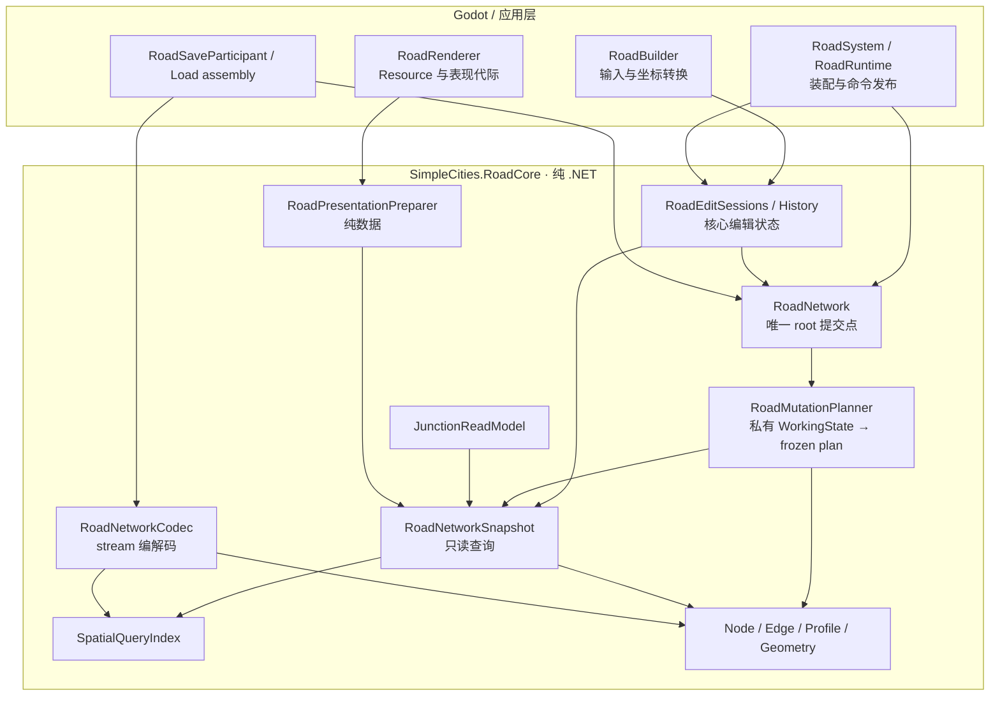
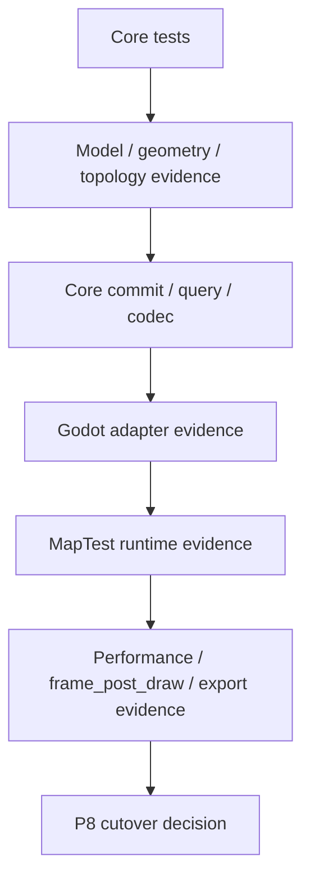

# 第四代道路系统重构指南

> 文档状态：重构设计基线，2026-09-08。
>
> V4 是一次破坏式重构。它建立新的道路核心、接口、数据模型和存档代际，最终由 Godot 适配层接入产品。V3 与第3.5代文档保留为历史基线，不代表 V4 已经实现。
>
> 后续道路重构以本指南为准，取代 V3.5 的渐进迁移顺序。开发期间 V4 在独立核心测试和验证场景中运行，正式主场景在验收后一次切换。旧缺陷作为 V4 回归输入，不要求先在 V3 修复整套系统。

## 1. 总体决定

当前 V3 已经建立了 canonical Edge、incidence、自环、平行 Edge、原生几何、不可变 revision、delta、token 和 prepared Load 等契约，但上一轮审计仍发现交点聚类排序、单段原生曲线自交、性能计数和非有限 bucket 参数问题。`RoadGraph` 仍同时承担规划、工作状态、索引、诊断、持久化和事件协调。`Scripts/Road/` 当前约 16,136 行，其中 `RoadGraph*.cs` 约 5,103 行，`RoadRenderer` 约 2,002 行。

V4 重新确定模块职责和依赖方向。下图箭头统一表示“调用方依赖被调用方”，核心不会反向依赖 Godot：



V4 采用一个新纯 .NET 项目 `SimpleCities.RoadCore`。核心不引用 Godot、场景树、`Resource`、`ArrayMesh`、`MultiMesh`、`SaveManager` 或 UI。Godot 项目只引用核心并承担输入、资源生命周期、显示和应用装配。

### 1.1 建议项目布局

以下是目标目录，当前尚未创建。先建一个核心程序集，职责通过 namespace 和访问级别隔离，不为每个小模块增加项目或 interface。

```text
src/SimpleCities.RoadCore/
  SimpleCities.RoadCore.csproj       # Microsoft.NET.Sdk / net10.0
  Model/                           # ID、实体、profile、不可变状态
  Geometry/                        # 六类原生几何及数值策略
  Spatial/                         # fragment、派生索引
  Queries/                         # snapshot、RoadLocation、junction
  Mutations/                       # request、planner、draft、plan
  Editing/                         # history、与引擎无关的交互会话
  Serialization/                   # 有界流式 codec
  Presentation/                    # 纯数值样式、mesh/surface 数据

Scripts/RoadRuntime/
  RoadSystem.cs                    # 生命周期与依赖装配
  RoadRuntime.cs                   # 应用命令入口、通知和代际协调
  RoadBuilder.cs                   # Godot 输入 adapter
  RoadRenderer.cs                  # Godot 资源 adapter
  RoadSaveParticipant.cs           # 现有存档接口 adapter
  RoadLoadAssembly.cs              # 道路、工具、表现的 Load 装配

tests/SimpleCities.RoadCore.Tests/  # 不启动 Godot 的行为测试
tests/godot/                       # V4 引擎与交互契约
```

根 `SimpleCities.csproj` 默认递归编译 C#，因此接入独立项目时必须从根项目移除 `src/**/*.cs` 的直接编译，并通过 `ProjectReference` 引用核心。核心测试只引用核心项目；Godot 集成测试再引用应用项目。验证每个源码文件只编译到预期程序集一次。

`Serialization` 可以依赖 .NET `Stream`，不拥有文件路径、磁盘锁或槽位发布。`Presentation` 可以使用纯数值颜色和宽度定义，不引用 Godot `Color` 或 Resource。非道路的相机、UI 布局及文件系统恢复协议只在接入所需范围内调整。

## 2. V4 的范围

### 2.1 必须实现

- canonical Node/Edge 模型；
- 强类型 `NodeId`、`EdgeId`、`RoadProfileId`；
- 六类现有原生几何；
- 正确处理开放 Edge、self-loop、parallel Edge、闭环、八字形和交点；
- 明确的几何容差、相交、重叠和未收敛结果；
- immutable network snapshot；
- planner、working draft、admission、change set 和一次性 commit；
- 只读道路查询 seam；
- 派生的 junction/turn read model；
- V4 独立 persistence codec；
- Godot renderer、输入会话、undo/redo 和异步 Load 适配；
- 与当前 V3 等价的编辑、选择、保存、加载和失败保护能力。

### 2.2 暂不实现

交通流、拥堵、车辆行为、复杂寻路、信号灯、车道、桥梁、隧道、立交和高程道路不属于 V4 核心重构。V4 只提供足够稳定的 `JunctionReadModel` 和 `TurnMovement` seam，供后续系统读取。

V4 也不提前实现 renderer chunk。只有性能数据证明 global batch 成为实际瓶颈时，才建立带 generation 和 ownership 的 chunk 模块。

## 3. 核心数据模型

### 3.1 身份和状态

```csharp
readonly record struct NodeId(int Value);
readonly record struct EdgeId(int Value);
readonly record struct RoadProfileId(string Value);

readonly record struct RoadStateToken(
    long NetworkInstance,
    long Lineage,
    long ContentRevision,
    long ChangeSequence);
```

Node ID 和 Edge ID 使用独立命名空间。运行时 token 不写入存档，存档只保存实体身份、内容版本和 `nextNodeId`/`nextEdgeId` watermark。

以上代码仅展示数据形状。正式 ID 必须验证正整数，`default` 和零不作为有效身份；初始 watermark 为 1，耗尽时在提交前拒绝。一个 Node 和一个 Edge 可以具有相同数值，codec 和查询必须依靠类型区分。

同一 network 内 `ChangeSequence` 每次成功提交递增；undo/redo 可以恢复旧 `ContentRevision`，但 sequence 和 ID watermark 不回退。新分叉分配新 content revision；Load 采用存档 watermark、创建新 lineage；创建新的 network facade 分配新 `NetworkInstance`。历史 token、plan 和 `RoadLocation` 均不能跨这些身份重用。

### 3.2 Node、Edge 和端接

```text
RoadNode
  NodeId
  RoadPoint Position
  IReadOnlyList<EdgeIncidence> Incidences

EdgeIncidence
  EdgeId
  Endpoint A | B
  NeighborNodeId

RoadEdge
  EdgeId
  NodeA / NodeB
  RoadProfileId
  GeometryChain
```

`Degree` 等于 incidence 数。self-loop 对同一个 Node 提供 A、B 两个不同端接。parallel Edge 始终按 EdgeId 区分。Edge 方向用于 canonical 表示，不自动代表交通方向。

Edge 仍表示两个结构节点之间的最大连续原生几何链。弯道和几何段连接处不自动创建 Node；真实交点、端点和 profile 变化形成结构节点。同 profile 的非结构性二度节点合并；不同 profile 保留。开放 Edge 按端点 ID 定向；自环在既定 seam 上选择稳定方向，反向时保留 A/B 角色映射。

孤立纯环保留一个 rooted seam：新建闭环使用规范输入起点；由已有二度环收敛时使用其中最小 NodeId。仍有真实 junction 时，seam 随拓扑收敛到结构节点，不能仅因旧 NodeId 较小而阻止合并。相同规范内容的同一快照必须确定序列化；不同建造顺序可以分配不同 ID，不承诺任意提交顺序产生相同 JSON 字节。

`RoadProfileId` 负责稳定语义身份；显示名称、颜色、宽度和材质属于 presentation catalog。速度、容量、费用等字段只有在有实际消费方和正式 schema 后才进入 profile。

首版使用版本为 1 的不可变内置 catalog，包含 `dirt`、`street`、`arterial`、`highway`。profile ID 已被建造、改造、merge key、读取和 codec 实际消费；暂不提供运行时自定义 profile。payload 保存 catalog version 和 Edge 的 profile ID，不保存样式 Resource。未知版本或 ID 在 Load 前拒绝，不能以默认街道代替。道路显示宽度暂属样式单位，不能作为车道数或通行容量。

### 3.3 数值模型

V4 设计基线采用 binary64 的独立 `RoadPoint`/`RoadVector`，在引擎 adapter 显式转换为 binary32 Godot `Vector2`。坐标仍为二维世界单位，首版保持 1 核心世界单位对应 1 Godot 世界单位，不把它自动解释为米。P1 必须固定：

- finite 和坐标范围；
- canonical zero；
- 几何长度与曲率范围；
- 空间误差和参数误差；
- binary64 exact-sign predicate 的使用位置；
- 曲线求交无法在预算内收敛时的 `Unresolved` 结果。

binary64 是对 V3 数值语义的明确变更：原有 binary32 exact-sign 代码需要重新实现或验证，旧阈值不能未经测量直接照搬。P1 记录坐标上限、snap 半径、cluster 直径、长度和工作预算的实际数值；P2 分别验证小坐标、大坐标、近切、近重叠和反向几何，未确定这些数值前不得进入拓扑集成。

引擎转换记录误差并检查有限性。可见 mesh 和 surface query 必须共用转换后相同的顶点，防止二者分别舍入；核心精确查询始终使用 binary64 原生几何。过小道路在大坐标下无法可靠呈现时，要在表现预检中明确拒绝或采用经过验证的局部原点转换。

统一使用 `RoadLocation(EdgeId, GeometryIndex, Parameter)` 表示路网中的点，用 `RoadLocationSpan` 表示同一 geometry 的参数区间。Geometry Kernel 的点结果只含参数、位置和残差，由查询或 planner 绑定 EdgeId。位置随来源 `RoadStateToken` 使用，split/merge 后不得继续解释旧参数。显示 span 插值得到的 location 是表面命中的来源定位，不能宣称为原生曲线的精确最近点。

## 4. 模块设计

### 4.1 `RoadNetwork`

这是核心唯一写入模块。它只持有当前 immutable snapshot，并负责：

1. 检查 request 的 base token；
2. 调用 planner 生成不可变 mutation plan；
3. 检查资源和历史 admission；
4. 交换新的 snapshot；
5. 返回 `RoadChangeSet`。

核心不要求调用者订阅 Godot 风格事件。应用层在成功 commit 后发布一次变更通知。通知必须携带 before/after token、created/removed/updated ID 和 full-reset 标志。核心 commit 不执行 observer、Godot 操作或等待；应用层 observer 失败不能改变已经提交的核心状态。

### 4.2 `RoadMutationPlanner`

planner 接收 immutable snapshot、request 和 numeric policy，创建私有 `RoadWorkingState`，返回完整且已冻结的 plan。plan 包含：

- 规范化后的输入几何；
- incoming/existing intersection witness；
- overlap 和 self-overlap 结论；
- split、merge、Node/Edge 创建和删除计划；
- 预计资源、候选和 witness 数量；
- before token；
- after snapshot 或可验证的 after state；
- `RoadChangeSet` 和资源预算。

planner 不读取活动 facade 的 mutable 字段，不触发事件，不创建 Godot 对象，也不在 commit 后继续补工作。需要多步 canonicalization 的算法全部在私有 draft 内完成；`RoadNetwork` 只接纳 base token 仍然匹配且预算通过的冻结 plan。

### 4.3 `RoadWorkingState`

working state 是 planner 或 network 在提交前使用的私有可变草稿。它集中管理实体表、incidence、ID reservation、派生索引和资源计数。草稿完成后生成 immutable snapshot；失败则直接丢弃草稿。

这取代当前 `RoadGraph` 内部的多个 builder、计数器和恢复路径。V4 不把可写 builder 暴露给 renderer、input、history 或存档。失败时丢弃 draft；不依赖把活动 root 改坏后再执行恢复。

working state 不能直接负责“所有权限”。它只接受 planner 已确定的操作，执行前后都运行 core invariant。ID reservation、资源预算和 history admission 失败时，活动 root、sequence、watermark 和 change set 均保持不变。

### 4.4 Geometry Kernel

Geometry Kernel 只处理：

- 几何段的位置、切线、长度、bounds 和 split；
- canonicalization 和 reverse；
- line/curve/curve 相交；
- overlap、tangent、crossing、endpoint touch；
- 单个 geometry 的 self-intersection；
- 显示层之外的 `GeometryLocation`。

同一套 kernel 必须服务 mutation、Load validation、read query 和 presentation preparation。当前 `RoadGeometryIntersectionQuery` 的自适应细分可以作为算法起点，但 V4 必须显式返回“命中、无命中、重叠、歧义、预算耗尽或未收敛”，不能把最大深度的叶节点默认当作数学精确结果。

V4 的核心库暂不设置 `IGeometryKernel` 这样的公共 interface。只有第二种实际算法需要在同一个消费点替换时，才建立 adapter seam；测试使用确定输入的纯函数和小型 fixture，不为抽象而增加一层转发。

完整的单段曲线自交流程是：

```text
segment
  -> parameter pair search (u, v)
  -> skip adjacent parameter band
  -> cluster positions
  -> create two split witnesses
  -> planner creates repeated crossing Node
  -> canonical Edge / self-loop result
```

### 4.5 `SpatialQueryIndex`

空间索引是派生结构，只提供粗筛 candidate，不决定道路是否相交。它必须：

- 拒绝非有限 bucket size、坐标和 bounds；
- 为长 geometry 使用有界 fragment；
- 保留 Edge、geometry index、参数区间和端点所有权；
- 对半径、矩形和 geometry 查询返回明确的 candidate metrics；
- 允许从 snapshot 完整重建；
- 不把显示采样点当作权威几何；
- candidate 超限时返回 `QueryBudgetExceeded`，不静默退化为全图扫描。

V4 的 metrics 至少分开记录 bucket visited、fragment candidates、exact geometry tests、full Edge visits 和结果 Edge 数。结果数量不能代替候选数量。空间索引查询返回 `SpatialQueryResult<T>`，包含 token、结果、候选统计和拒绝原因；调用者不再通过内部计数器猜测查询是否走了全表。

### 4.6 `RoadNetworkReadModel`

所有消费者通过 `IRoadNetworkReadModel` 读取：

- Edge/Node view；
- incidence 和端点切线；
- Edge 的 `GeometryLocation`；
- nearest/near/intersection 查询；
- connected Edge 的稳定排序；
- token-bound snapshot。

返回值不暴露工作 builder、bucket page、Godot 类型或 renderer cache。`RoadSurfaceSnapshot` 是表现层读取模型，不能替代核心道路 read model。核心 read model 的 public contract 不返回 `GraphNode`/`GraphEdge` 具体可变实现，旧测试通过 snapshot view 或 test codec 读取。

### 4.7 `JunctionReadModel`

它从同一个 immutable snapshot 派生，不持久化，也不修改道路图。每个 `JunctionView` 保存：

- NodeId 和位置；
- 端接 EdgeId、Endpoint、profile 和出射切线；
- 稳定排序；
- 端接之间的 `TurnMovement`；
- 转向角和几何关系；
- 来源 `RoadStateToken`。

self-loop 必须产生 A→B、B→A 等可区分 movement。parallel Edge 不能通过 `NeighborNodeId` 去重。V4 第一版只产生几何上的 movement 描述和稳定 ID，不擅自判断红绿灯、容量或车辆许可。该模型先服务诊断或路口可视化，之后再由交通系统消费。

### 4.8 Persistence Codec

V4 使用新的 `simple-cities-v4` format family 和新的保存根，例如 `user://saves-v4/`。V4 payload 至少包含：

```json
{
  "formatFamily": "simple-cities-v4",
  "payloadType": "road-network",
  "schemaVersion": 1,
  "nextNodeId": 1,
  "nextEdgeId": 1,
  "profileCatalogVersion": 1,
  "nodes": [],
  "edges": []
}
```

Node、Edge、geometry 和 profile 均按稳定 ID 排序。reader 只接受规范格式，拒绝未知字段、重复字段、错误 profile、悬空 endpoint、内部未建 Node 的交点、错误 self-loop seam 和不可收敛 geometry。当前内置 profile catalog 的四个 ID 固定为 `dirt`、`street`、`arterial`、`highway`，catalog version 不等于 schema version。

V4 不在普通运行时 Load 中读取或转换 V3 数据。若以后需要迁移，单独制作离线 converter，输出经过 V4 reader 再验证的新 payload。

## 5. Godot 适配层

### 5.1 输入

`RoadEditController` 负责将输入映射为核心 request。现有 Placement、Removal 和 Upgrade session 可以保留交互语义，但只保存 token-bound read snapshot 和用户选择，不直接读取核心内部集合。它不再同时承担 RoadGraph mutation、history admission 和 renderer token 判断；这些信息由核心结果和 presentation adapter 返回。

提交路径统一为：

```text
InputEvent
  -> Session
  -> RoadMutationRequest
  -> RoadNetwork.Plan / Commit
  -> RoadChangeSet
  -> History + Presentation invalidation
```

UI 不能创建 Node、Edge 或 profile，也不能直接调用 renderer 的 surface geometry 来决定领域拓扑。renderer surface 只用于“玩家点击了当前看见的哪一条 Edge”，最终领域合法性仍由 core planner 判断。

### 5.2 表现

`RoadPresentationPreparer` 接收 read snapshot 和 presentation catalog，生成纯数据：display points、ribbon vertices、surface primitives、owner、`RoadLocation` 和 presentation metrics。

`RoadRenderer` 只负责：

- Godot Resource 创建和释放；
- desired/presented render token；
- deferred rebuild；
- stale result 拒绝；
- hidden Resource Preflight；
- final reference commit；
- provider 查询。

普通 rebuild 与 Load 必须共用同一个 pure preparer。`ArrayMesh`、`MultiMesh` 和 scene tree 操作不得进入核心或 worker preparation。

### 5.3 存档装配

新增 `RoadSaveParticipant` 将核心 snapshot/prepare state 适配到现有 `IStreamingSaveable`。`SaveManager` 和 `PreparedAggregateLoad` 继续管理操作 token、scene generation、文件锁和多 participant 协调。

commit plan 必须满足现有 `INonThrowingLoadCommitPlan` 的真实含义：

- `CommitReferences()` 不抛异常；
- 不 yield；
- 不创建 Resource；
- 不读写文件；
- 不调用用户回调；
- 只交换已准备引用和状态。

如果未来 participant 无法满足这些条件，先重新设计 rollback 协议，再加入 aggregate，不能继续扩大“全有或全无”的承诺。

## 6. 实施阶段

### P0：冻结 V3 和建立新项目

保留 V3 分支和当前测试基线。创建 `SimpleCities.RoadCore` 与独立 core tests。当前 V3 的 959/959、Debug/ExportRelease build 和已记录 runtime 证据只作为基线，不混入 V4 通过数。P0 先验证新的程序集边界：核心可以独立编译，根 Godot 项目不重复编译核心源文件，核心测试不加载 Godot。

P0 同时登记当前已确认问题：交点 cluster 空间排序、单段曲线自交、空间 metrics、非有限 bucket 和旧类参考文档。它们作为 V4 的回归输入；修复 V3 还是直接在 V4 重新实现，由对应阶段决定。

### P1：模型和 numeric policy

完成强类型 ID、`RoadPoint`、Node、Edge、incidence、profile identity、token 和 immutable snapshot。建立所有核心 invariant，暂不接 Godot。P1 不实现交点、空间索引和存档，只建立它们之后必须消费的内容模型。

### P2：Geometry Kernel

迁移六类 geometry，完成 canonicalization、reverse、split、精确 sign、容差查询、overlap、tangent、self-intersection 和未收敛结果。V4 必须用当前已发现的 Cubic Bézier 自交样例作为回归夹具。曲线 Kernel 的 public 结果必须包含状态和残差，不能只返回空列表而隐藏未收敛。

### P3：Spatial index 和 Read Model

建立 fragment index、局部查询 metrics、`IRoadNetworkReadModel` 和 `JunctionReadModel`。验证远端 Edge 增长不会改变固定局部查询的 exact work；同时记录大矩形、长斜线和高密度 junction 的真实成本。先让一个实际诊断消费者使用 read model，再扩展到 renderer 和输入，避免接口成为没有消费者的薄适配器。

### P4：Planner、WorkingState 和 Commit

实现 path submission、split、merge、delete、profile change、容量 admission、`RoadChangeSet` 和 token 校验。成功命令只能产生一次 snapshot swap；失败只能丢弃 draft。一个 request 先在私有 working state 中完整规划，再一次发布；禁止复用 V3 的“修改活动 builder、失败后恢复”作为 V4 公开流程。

### P5：History 和 V4 Codec

将 history 改为核心 change set 的消费者，建立 V4 writer/reader 和 prepared load state。V4 存档先在 core tests 中完成 deterministic round-trip，再接入 SaveManager。history 只保存有限的 change set 和完整 token；Load 产生新 lineage 并清空旧 history。codec 只创建 prepared state，不直接修改活动 network。

### P6：Presentation Adapter

将现有 pure preparer 迁入 `RoadPresentationPreparer`，保持 ribbon、terminal cap、semantic join、junction patch 和 owner query 的视觉及定位语义。renderer 只接收准备好的数据。presentation owner 可以引用 EdgeId/NodeId，但不能把 triangle、颜色或宽度写回 core snapshot。

### P7：Input、UI 和 SaveManager 接入

实现 `RoadEditController`、三个 session、RoadType/profile 选择、undo/redo 和 aggregate Load。旧 UI 逐个改为读取 read model 和 operation state。此阶段才把核心网络作为现有 `IStreamingSaveable` 的 adapter 注册给 SaveManager；核心库不依赖 `Scripts/Core`。

### P8：一次切换

将 `RoadSystem` 改为创建 V4 network，接入 V4 save participant、renderer 和 controller。先在隔离场景验证新旧主场景状态摘要，再切换 `MapTest`。完成后删除 V3 道路生产装配、旧 writer、旧事件和旧 public 入口；V3 代码只留在 Git 历史和文档中。

### P9：最终验收

串行执行 core tests、solution build、Godot editor/resource 检查、真实 `MapTest` runtime、存档故障场景和性能矩阵。任何 V3 旧测试若与 V4 明确新契约冲突，应改写为 V4 测试并记录行为改变。V4 通过后再删除未使用旧源文件，并复查根项目、导出程序集和 QA 过滤规则。

## 6.1 实施图

实施采用一条核心主线和三条可并行工作流。所有箭头表示前置依赖；虚线表示“只读取已经冻结的契约”，不表示新增写入路径。

```mermaid
flowchart LR
    P0["P0 冻结 V3<br/>建立 RoadCore 项目边界"] --> G0{{"G0<br/>核心独立编译"}}
    G0 --> P1["P1 模型与数值策略<br/>ID / Snapshot / Profile"]
    P1 --> G1{{"G1<br/>模型 invariant"}}
    G1 --> P2["P2 Geometry Kernel<br/>六类几何 / 自交 / overlap"]
    P2 --> G2{{"G2<br/>几何结果确定"}}
    G2 --> P3["P3 Spatial + Read Model<br/>查询 / Junction / Turn"]
    G2 --> P6["P6 Presentation Preparer<br/>纯 mesh / surface 数据"]
    P3 --> G3{{"G3<br/>读取 seam 稳定"}}
    P3 --> P4["P4 Planner + WorkingState<br/>split / merge / delete / commit"]
    G3 --> P4
    P4 --> G4{{"G4<br/>单 root / 单 change set"}}
    G4 --> P5["P5 History + V4 Codec<br/>delta / reader / writer"]
    P6 --> G6{{"G6<br/>owner 与 location 一致"}}
    P5 --> G5{{"G5<br/>V4 round-trip"}}
    G5 --> P7["P7 Godot Adapter<br/>Renderer / Input / SaveManager"]
    G6 --> P7
    P7 --> G7{{"G7<br/>真实场景接入"}}
    G7 --> P8["P8 一次切换<br/>RoadSystem → V4"]
    P8 --> G8{{"G8<br/>V3 生产路径移除"}}
    G8 --> P9["P9 最终验收<br/>Core / Godot / 性能 / 导出"]
```



| 阶段 | 主要工作流 | 输入 | 输出 | 必须停止的条件 |
| --- | --- | --- | --- | --- |
| P0 | 工程边界 | V3 稳定分支、当前项目文件 | 独立 core project、core tests、程序集规则 | core 仍引用 Godot，或源文件被重复编译 |
| P1 | 核心模型 | 无 | Node/Edge/Profile/Token/Snapshot | ID、profile、numeric policy 没有版本或 invariant |
| P2 | 几何 | P1 model | geometry result、location、split witness | 自交、重叠或未收敛没有确定结果 |
| P3 | 读取 | P1 + P2 | SpatialQuery、ReadSnapshot、Junction/Turn | consumer 需要直接访问 builder、bucket 或旧 GraphEdge |
| P4 | 写入 | P2 + P3 | MutationPlan、WorkingState、ChangeSet、commit | 失败需要修改活动 root 后回滚，或出现第二个写入点 |
| P5 | 历史与存档 | P4 change set | V4 codec、prepared state、bounded history | codec 修改活动 network，或 V3/V4 writer 并存 |
| P6 | 表现数据 | P2 + P3 | presentation snapshot、owner、mesh arrays | worker 创建 Godot Resource，或 surface 与 mesh 来源不同 |
| P7 | 引擎接入 | P3/P4/P5/P6 | Renderer、Input、SaveManager adapters | SaveManager 仍绑定 RoadGraph，或 UI 直接写核心 |
| P8 | 切换 | P7 全部通过 | V4 `RoadSystem`、V4 保存根、唯一生产路径 | V3/V4 双 runtime、双事件或双 writer |
| P9 | 收口 | P8 | 完整验证报告、删除旧生产文件 | 任一核心、runtime、性能、导出或清理门失败 |

### 6.1.1 并行安排

P0 和 P1 是共同前置。P2 完成后，P3 和 P6 可以并行：P3 负责领域读取，P6 负责纯表现数据。P3 和 P6 都不能自行创建新的领域写入路径。P4 是核心写入主线，完成后 P5 与 P7 的部分准备可以并行；P7 必须等待 P5 和 P6 的正式接口全部冻结。

建议按以下工作包组织提交和审查：

```text
W0  Core project / solution boundary
W1  Core model / numeric policy / invariants
W2  Geometry kernel / self-intersection
W3  Spatial index / read snapshot / junction view
W4  Mutation planner / draft / change set / commit
W5  History / V4 codec / prepared load
W6  Pure presentation preparer
W7  Godot renderer / input / SaveManager host
W8  MapTest cutover / remove V3 road runtime
W9  Final QA and evidence
```

每个工作包结束时只做三件事：运行该包的 focused tests、运行受影响的回归门、记录新接口和证据。未完成的工作包不通过临时转发或手工场景状态标记为完成。

### 6.1.2 P7 的真实接入顺序

P7 不能只把 V4 类型塞进现有 `SaveManager`。当前 `SaveManager` 直接使用 `RoadGraph`、`RoadGraphRevision`、`RoadRendererPreparedLoad`、`SceneLoadContext` 和 `user://saves-v3`。V4 应按以下顺序拆开：

1. 把 `SceneLoadContext` 改为持有通用 network runtime、tool runtime、presentation runtime 和 slot target participant。
2. 把 `PreparedLoadWork` 改为通用 prepared network/presentation payload，不再出现 `RoadGraphRevision` 和 `RoadRendererPreparedLoad`。
3. 将 `SaveBaseDir`、required payload 和错误文案从 V3 常量改为 V4 storage policy。
4. 让 `RoadSaveParticipant` 负责 core codec 与现有 `IStreamingSaveable` 的转换。
5. 让 `RoadLoadAssembly` 负责 admission、preflight、reference swap、notification 和 cleanup plan 的组装。
6. 通过真实 V4 participant 后，才切换 `RoadSystem` 和 `ToolManager` 的持有类型。

这一顺序保证 SaveManager 只协调 participant，不知道道路实体的具体类型；它也使 V4 核心可以在没有 Godot 的测试中独立验证。

### 6.1.3 切换点和回退点

P8 之前，V3 是正式主场景的唯一道路 runtime，V4 只运行于 core tests、隔离验证场景和独立 V4 保存根。P8 需要形成一份切换清单：

- `RoadSystem`、`ToolManager`、`GameHUD`、`DebugPanel` 和 SaveManager 的引用已全部迁移；
- V4 network、renderer、input、history 和 save participant 在同一场景中只各有一个实例；
- 新旧保存根均可被单独识别，V4 操作不会触碰 V3 根；
- 切换前保留 V3 可运行分支，切换失败可以回到该分支；
- 切换后清理旧源文件前，再执行一次全量测试和导出文件扫描。

V4 发布策略必须在 P8 前决定：继续隐藏 V3 存档、提供一次性离线 converter，或明确从空的 V4 存档开始。普通运行时不能悄悄把 V3 存档转换成 V4。

### 6.1.4 证据流



证据必须沿这条顺序积累。Core test 通过不能代替 Godot runtime；renderer runtime 通过不能代替 V4 codec；100K 压力结果不能代替 10K 连续交互门。每次性能报告都要分别列出 domain、worker prepare、preflight、reference commit、presentation commit、frame post draw 和端到端时间。

## 7. 验收门

V4 完成前必须同时满足：

1. core library 不引用 Godot 或应用层类型；
2. 生产只有一个道路 network、一个 writer、一个 reader 和一个 commit 入口；
3. self-loop、parallel Edge、单段曲线自交和多段自交均有明确结果；
4. planner、query、renderer 和 persistence 共享同一 immutable snapshot 语义；
5. Node/Edge/profile identity、geometry location 和 token 规则均有自动化测试；
6. 失败不会留下部分 Node/Edge、ID、history、surface、slot 或 token 状态；
7. Load commit 的 non-throwing 前提有源码约束和故障测试；
8. 普通 mutation 和 Load 的 presentation owner、mesh 和 hit location 可逐值比较；
9. 10k junction-dense 与 geometry-dense 的连续交互满足 16.67 ms P95 门；100k 只作为压力记录；
10. 性能报告分开列出 domain、prepare、preflight、commit、draw 和端到端时间；
11. V4 存档使用新的 family/root，V3 数据没有被普通运行时读取或修改；
12. V3 旧生产文件、双路径和临时兼容 facade 已删除。

“原子”在 V4 中必须指明层级：core network 的 snapshot swap 是单一同步引用替换；presentation 和 SaveManager 的多 participant commit 依赖各 plan 的 no-throw、no-yield contract。若 participant 不能满足这个 contract，必须先设计 rollback 或 journal，不得把普通异常隔离成 warning 后继续声称整个 aggregate 可回滚。

## 8. 禁止的重构方式

- 直接把现有 `RoadGraph*.cs` 改名后宣称完成解耦；
- 在 `RoadGraph` 和 `RoadNetwork` 中保留两套规划算法；
- 用 event bus 代替明确的 `RoadChangeSet`；
- 把 `RoadSurfaceSnapshot` 当作领域拓扑；
- 让核心依赖 Godot `Vector2` 或 Resource；
- 让 traffic、UI 或 renderer 写回核心状态；
- 在 V4 reader 中兼容性忽略 V3 字段；
- 为测试方便暴露 mutable builder；
- 为了性能门关闭 invariant 或把候选数记成最终命中数；
- 在 commit 阶段执行可能失败的几何、文件或 Resource 工作。

## 9. 第一批实际交付

V4 的第一批应只包含：

```text
SimpleCities.RoadCore 项目骨架
RoadPoint / RoadVector / NodeId / EdgeId / RoadProfileId
RoadNode / RoadEdge / EdgeIncidence
RoadNetworkSnapshot / RoadStateToken
基础 numeric policy
基础 invariant tests
V4 core test project
```

这一批不接 UI、不改场景、不改 SaveManager，也不删除 V3 代码。它通过后再进入 Geometry Kernel。这样可以先验证新的依赖方向和模块深度，再承担几何迁移的风险。

## 10. 依据与状态边界

- [`docs/manuals/road-system-v3-gen.md`](./road-system-v3-gen.md)：V3 规范和历史验收。
- [`docs/manuals/road-system-v3.5-gen.md`](./road-system-v3.5-gen.md)：V3.5 评估、重构批次和已知审计问题。
- [`Scripts/Road/RoadGraph.cs`](../../Scripts/Road/RoadGraph.cs)：当前 facade、mutable working state 和查询入口。
- [`Scripts/Road/RoadGraph.PathSubmission.cs`](../../Scripts/Road/RoadGraph.PathSubmission.cs)：当前 native path 规划入口。
- [`Scripts/Road/RoadGraph.NativePathIntersections.cs`](../../Scripts/Road/RoadGraph.NativePathIntersections.cs)：当前交点、overlap 和 split witness 规划。
- [`Scripts/Road/RoadGraph.Transactions.cs`](../../Scripts/Road/RoadGraph.Transactions.cs)：当前 revision、delta、token 和 commit。
- [`Scripts/Road/RoadIntersectionClusterer.cs`](../../Scripts/Road/RoadIntersectionClusterer.cs)：交点聚类实现。
- [`Scripts/Road/RoadRenderer.LoadCommit.cs`](../../Scripts/Road/RoadRenderer.LoadCommit.cs)：当前 presentation prepare 与 Resource commit plan。
- [`Scripts/Core/PreparedAggregateLoad.cs`](../../Scripts/Core/PreparedAggregateLoad.cs)：当前多 participant Load commit 协议。
- [`Scripts/Core/SaveManager.cs`](../../Scripts/Core/SaveManager.cs)：当前 Godot 存档装配和异步 Load。

V4 指南是设计文档，不代表本次已经完成代码迁移。V4 实现阶段应逐批更新本文件的状态、证据和实际目录，避免把设计目标写成已验证事实。
