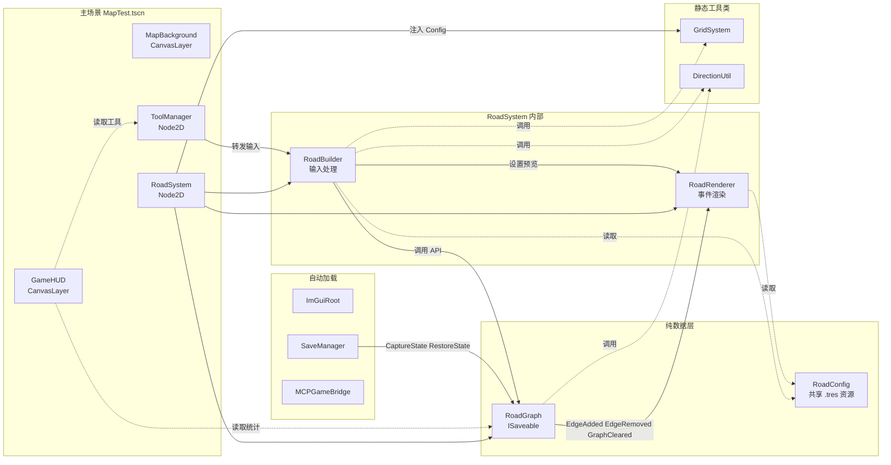
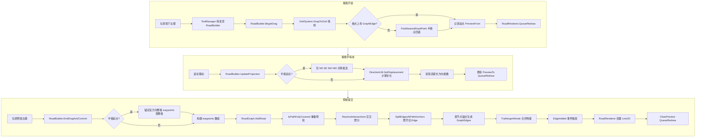
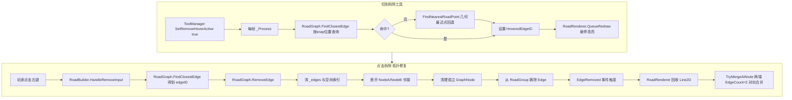
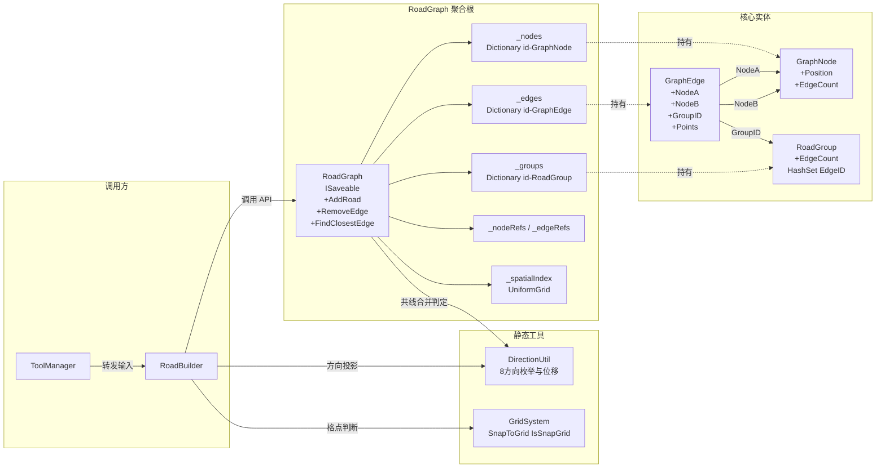
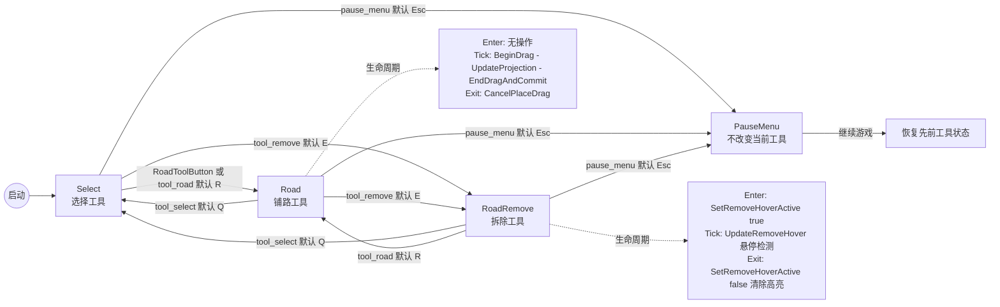
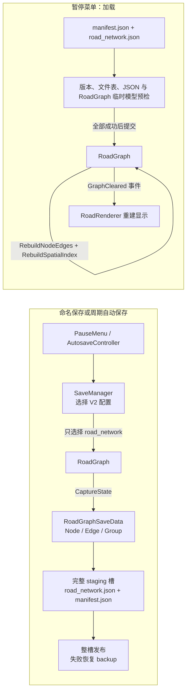
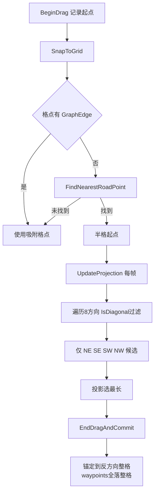
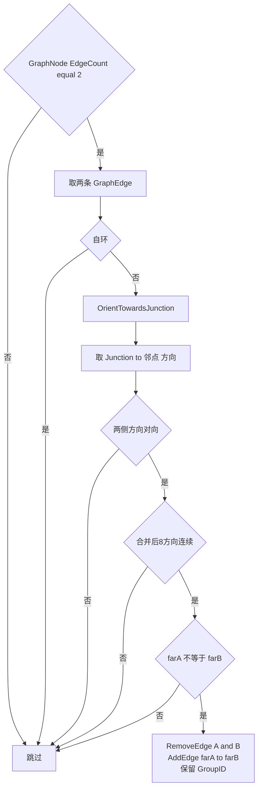
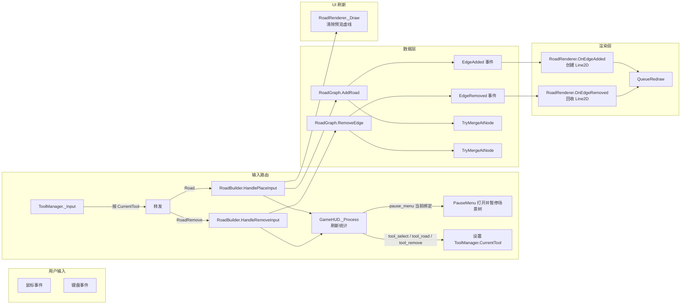

# 游戏总体逻辑

> 最后更新：2026-07-19
>
> 当前实现范围：本文的道路、HUD、相机和存档流程已按当前 Godot/C# 源码校准。分区、经济、时间和交通模拟仍是设计文档中的未来系统，不是已实现功能。

---

## 1. 系统架构总览

---

## 2. 道路铺设完整流程

---

## 3. 道路拆除 + 拓扑修复

---

## 4. 路网数据模型

---

## 5. 工具状态机

---

## 6. 存档 / 读档流程

本节只说明游戏流程中的保存和加载路径。存档目录、槽名限制、manifest、schema、验证状态和未完成事务边界见 [存档系统当前参考](save-system-plan.md)。

---

## 7. 关键决策流程

### 7.1 半格点拖拽方向限制

### 7.2 对向合并降级(TryMergeAtNode)

---

## 8. 事件流

